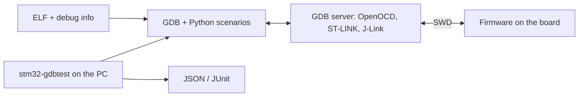

# stm32-hwtest-blackpill

[Русский](README.md)

A demo project of [stm32-gdbtest](https://github.com/ViacheslavMezentsev/stm32-gdbtest): the
running firmware on a WeAct BlackPill board (STM32F411CE and STM32F401CC) is checked through GDB
and an SWD debugger by Python scenarios — the DDTT method (Debugger-Driven Testing on Target).
There is no test code in the firmware.

The firmware is deliberately simple: `setup()` configures the ADC with DMA, the RTC and TIM2;
every 500 ms `loop()` measures the chip temperature and VDDA with the factory calibration,
reschedules the RTC alarm, blinks the LED and sleeps in WFI. CMSIS is the only library.



## Boards

| Profile (`BOARD`) | Board | MCU | Flash / RAM | LED |
| --- | --- | --- | --- | --- |
| `F411CE` | [WeAct BlackPill](https://github.com/WeActStudio/WeActStudio.MiniSTM32F4x1) V3.1 | STM32F411CEU6 | 512 / 128 KiB | PC13, on at 0 |
| `F401CC` | WeAct BlackPill v3.0 | STM32F401CCU6 | 256 / 64 KiB | PC13, on at 0 |

Only SWD, power and ground are needed: no UART and no external wiring. The debugger is selected by
its serial number in the stand file.

## Requirements (Windows)

- [xPack GNU Arm Embedded GCC 13.3.1-1.1](https://github.com/xpack-dev-tools/arm-none-eabi-gcc-xpack/releases/tag/v13.3.1-1.1),
  unpacked to `%USERPROFILE%\xpack-arm-none-eabi-gcc-13.3.1-1.1`, or its path in
  `ARM_TOOLCHAIN_ROOT` (the Linux default is `/opt/xpack-arm-none-eabi-gcc-13.3.1-1.1`);
- CMake ≥ 3.25 and Ninja on `PATH`;
- for HIL tests: Python ≥ 3.11 and an ST-Link with OpenOCD (or a J-Link);
- VS Code with CMake Tools, C/C++ and Cortex-Debug (optional).

## Getting and building

```powershell
git clone --recursive https://github.com/ViacheslavMezentsev/stm32-hwtest-blackpill.git
cd stm32-hwtest-blackpill
cmake --preset Debug_F411CE
cmake --build --preset Debug_F411CE
```

If the repository was cloned without `--recursive`: `git submodule update --init`.

| Preset | Purpose |
| --- | --- |
| `Debug_F411CE`, `Release_F411CE` | build for F411CE (`build/<preset>`) |
| `Debug_F401CC`, `Release_F401CC` | build for F401CC |
| `HIL_F411CE`, `HIL_F401CC` | Debug build with stm32-gdbtest HIL tests |

Test presets: `HIL_*-host` and `HIL_*-hw`. Output: `build/<preset>/` — ELF, HEX and BIN
(BIN gaps are filled with 0xFF). Each board and toolchain needs its own build directory.

## Application

- ADC1 scans the temperature sensor (channel 18 on F411, 16 on F401) and VREFINT (17); DMA2
  stream 0 moves the two samples; VDDA and temperature use the factory calibration.
- TIM2 overflows every 100 ms; the LSI-driven RTC wakes the application with an alarm every two seconds.
- `app_idle()` sleeps in ordinary WFI (not Stop); the 1 ms SysTick runs from the 16 MHz HSI.

Debugger stops change the timing, sleep tests do not measure current, calibration vectors check the
arithmetic rather than the temperature accuracy.

## HIL tests

The scenarios in `hil/tests/board` (stm32-gdbtest v0.4.0, 22 scenarios) check the firmware on
the board: startup and clock, the LED, the run profile, ADC and DMA (configuration, publication, who
counts the measurements, a measurement series), TIM2 and RTC, WFI sleep, and the reaction to
injections — ADC and DMA failures, substituted samples and calibrations, a lost callback, an LSI wait
that cannot succeed. The MCU description and the board data file, shared by all scenarios, describe
the board. Without a board the requirement traceability and run preparation are checked
(`ctest --preset HIL_F411CE-host`); on the board run `ctest --preset HIL_F411CE-hw` after setting
up a stand. Details: [hil/README.en.md](hil/README.en.md).

Latest hardware run: F411CE and F401CC through ST-Link/OpenOCD — 22/22 PASS each.

## Layout

```text
src/            firmware: main, setup/loop, platform (CMSIS), ADC arithmetic
cmsis/          CMSIS headers (unmodified)
ld/             linker script (Flash and RAM per board)
cmake/          toolchain and HIL integration
hil/            run configurations, MCU descriptions, board data, scenarios and requirements, stands
modules/        stm32-gdbtest (Git submodule)
ci/             offline checks in Docker: build, scenario preparation, ADC arithmetic
resources/      SVD files for debugging in VS Code
docs/history/   history of the project stm32-gdbtest was extracted from
archive/        retained material: former HAL sources, K1921 and H503 examples, experiments
.claude/skills/ stm32-gdbtest agent skills
.vscode/        tasks, debug configurations, settings
.github/        GitHub Actions: offline checks
```

## Documentation

- stm32-gdbtest v0.4.0: [README](https://github.com/ViacheslavMezentsev/stm32-gdbtest/blob/v0.4.0/README.en.md), [API reference](https://github.com/ViacheslavMezentsev/stm32-gdbtest/blob/v0.4.0/docs/en/api/index.md),
  [testing techniques](https://github.com/ViacheslavMezentsev/stm32-gdbtest/blob/v0.4.0/docs/en/TESTING_TECHNIQUES.md), [agent skills](https://github.com/ViacheslavMezentsev/stm32-gdbtest/blob/v0.4.0/skills/README.en.md).
- This project: [HIL tests](hil/README.en.md), [requirements](hil/tests/requirements.md) (Russian),
  [changes](CHANGELOG.en.md), [development rules](AGENTS.md).
- [History](docs/history/README.md) (Russian): the project began as HAL experiments on several STM32
  boards and stm32-gdbtest was extracted from it; the protocols, architecture and plans of that
  period are kept.
- A similar example: [stm32-hwtest-bluepill](https://github.com/ViacheslavMezentsev/stm32-hwtest-bluepill).

## License

MIT ([LICENSE](LICENSE)). The `cmsis/` files are third-party code by Arm and STMicroelectronics under their licenses
([cmsis/README.md](cmsis/README.md)).
