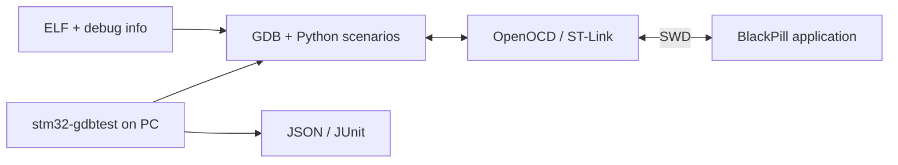

# stm32-hwtest-blackpill

[Русский](README.md)

A standalone WeAct BlackPill application tested on the MCU through **GDB-Python
and SWD**. [stm32-gdbtest](https://github.com/ViacheslavMezentsev/stm32-gdbtest)
runs host-side Python scenarios, stops firmware, reads variables and registers,
and injects faults without adding test hooks to the application.

The project began as HAL experiments across several STM32 boards. The reusable
runner and multi-MCU fixtures now belong to stm32-gdbtest. This repository provides
a CMSIS consumer for two BlackPill variants. Historical HAL sources are retained in the [reference archive](legacy/hal/README.md);
their results do not prove CMSIS behavior.



## Boards and behavior

| Profile | MCU / board | Flash / RAM | LED |
| --- | --- | --- | --- |
| F411CE | STM32F411CEU6 / WeAct BlackPill V3.1 | 512 / 128 KiB | PC13, active-low |
| F401CC | STM32F401CCU6 / BlackPill v3.0 | 256 / 64 KiB | PC13, active-low |

[WeAct board project](https://github.com/WeActStudio/WeActStudio.MiniSTM32F4x1).
The application blinks the LED, samples internal temperature/VREFINT via ADC/DMA,
handles TIM2 and RTC events, and sleeps using WFI. No UART or external peripheral
wiring is required. Connect SWD, power and ground; select the debugger explicitly
by serial. A different DEV_ID does not expand the configured memory limits.

## Build

Requirements: Git, CMake 3.25+, Ninja, GNU Arm GCC (tested with xPack 13.3.1-1.1).
CMSIS headers are included; CubeMX is not required for the new build. HIL also
requires Python 3.11+, Python-enabled GDB, OpenOCD and ST-Link.

```sh
git clone --recurse-submodules https://github.com/ViacheslavMezentsev/stm32-hwtest-blackpill.git
cd stm32-hwtest-blackpill
cmake --preset Debug_F411CE
cmake --build --preset Debug_F411CE
```

Set `ARM_TOOLCHAIN_ROOT` in the environment or CMake cache. Defaults:
`%USERPROFILE%/xpack-arm-none-eabi-gcc-13.3.1-1.1` on Windows,
`/opt/xpack-arm-none-eabi-gcc-13.3.1-1.1` on Linux. Use separate build directories
for different MCUs/toolchains. ELF, HEX and BIN are written to `build/<preset>/`.
BIN gaps use 0xFF; loading ELF does not guarantee the contents of gaps on the MCU.

| Purpose | F411CE | F401CC |
| --- | --- | --- |
| Debug firmware | Debug_F411CE | Debug_F401CC |
| Size optimization | Release_F411CE | Release_F401CC |
| GDB scenarios and prepare | HIL_F411CE | HIL_F401CC |

## Tests

```sh
cmake --preset HIL_F411CE
cmake --build --preset HIL_F411CE
ctest --preset HIL_F411CE-host
```

This prepares tests without hardware. Copy `hil/stands/f411ce.example.toml` to
`hil/stands/f411ce.local.toml`, set the debugger serial and OpenOCD path, then run
`ctest --preset HIL_F411CE-hw`. Substitute F401CC and its stand file as needed.
Do not use VS Code and the runner with the same debugger concurrently. VS Code
launch configurations ask for a serial and select the matching SVD.
See [HIL details](hil/README.md) (Russian).

## Limits and further reading

Debugger stops affect timing; Sleep checks do not measure current. Calibration
vectors test arithmetic, not sensor accuracy. Scenario authors need to understand
GDB, frame context and macro availability with `-g3`; GDB expressions do not support
arbitrary C/C++ execution. F4 emulation using Renode/QEMU is not validated here.
CI build/prepare is not hardware validation.

- [Status](docs/STATUS.md), [hardware acceptance](docs/BLACKPILL_CMSIS_APPLICATION.md), [CI](docs/CI.md) (Russian).
- [Documentation](docs/README.md), [architecture](docs/HWTEST_ARCHITECTURE_V2.md), [roadmap](TODO.md) (Russian).
- `src/`: application; `cmsis/`: vendor headers; `ld/`, `cmake/`: build; `hil/`: profiles and scenarios.
- Related: [BluePill consumer](https://github.com/ViacheslavMezentsev/stm32-hwtest-bluepill), [stm32-cmake-yml](https://github.com/ViacheslavMezentsev/stm32-cmake-yml).

Project code: [MIT](LICENSE). CMSIS: [separate licenses and provenance](cmsis/README.md).

[Repository layout](docs/PROJECT_LAYOUT.md) (Russian): active code, archive, retained examples and H503CB.
