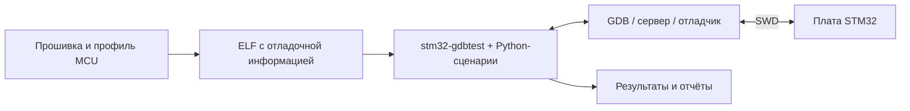

# stm32-hwtest-blackpill

Примеры и аппаратный стенд для проверки прошивок STM32 через
[stm32-gdbtest](https://github.com/ViacheslavMezentsev/stm32-gdbtest).
Python-сценарии на ПК управляют GDB и проверяют приложение на реальной плате
через SWD. Репозиторий помогает освоить этот подход и проверять изменения
самого модуля на разных MCU и отладчиках.

## Зачем создан проект

Проверка чистой арифметики на ПК не показывает, правильно ли настроены GPIO,
DMA, таймеры и прерывания реального MCU. Ручная отладка позволяет это увидеть,
но её трудно повторять после каждого изменения. Проект вырос из опытов
автоматизации таких проверок через GDB-Python: общая инфраструктура выделена
в stm32-gdbtest, а здесь остались прошивки, сценарии и практические результаты.

Тесты не компилируются в прошивку. Они используют её ELF с отладочной информацией,
останавливают MCU в выбранных точках, читают переменные и регистры, проверяют
поведение. Остановки и инъекции влияют на выполнение — это часть метода,
которую нужно учитывать при проверке времени, IRQ и энергопотребления.

## Что находится в репозитории

- `User/` — общая логика примера: LED, ADC, DMA, таймеры, RTC и Sleep.
- `profiles/` — отдельные CubeMX-проекты, адаптеры MCU и ожидания тестов.
- `Tests/` — сценарии приложения, требования и шаблоны стендов.
- `examples/minimal-consumer/` — небольшой пример подключения без YAML-фреймворка.
- `modules/` — закреплённые зависимости сборки и тестирования.
- `docs/` — методика, архитектура, настройки и протоколы опытов.

Рабочие профили: WeAct BlackPill V3.1 (STM32F411CEU6), BlackPill v3.0
(STM32F401CCU6) и BluePill V1.1 / BluePill-Plus (STM32F103C8T6).
[NUCLEO-F030R8](profiles/f030r8/README.md) проверен через встроенный J-Link STLink/SWD.
[STM32F429I-DISCO](profiles/f429zi/README.md) проверен через встроенный ST-Link/V2/OpenOCD.
Профиль STM32H503CBT6 подготовлен частично и ещё не включён в сборку.
Точные сочетания плат/серверов, результаты и ограничения — в [текущем состоянии](docs/STATUS.md).

Отдельный [эксперимент К1921ВГ015/RISC-V](examples/k1921vg015-poc/README.md)
исследует переносимость подхода через J-Link/JTAG; он ещё не является штатным профилем модуля.

## Зависимости и начало работы

Основная среда — Windows, PowerShell и VS Code. Нужны Git, CMake/Ninja,
Python 3.11+, yq v4, ARM GCC с GDB-Python и соответствующие STM32Cube-пакеты.
Для аппаратных проверок — плата, SWD-отладчик ST-Link либо J-Link и совместимый
GDB-сервер. Зависимости сборки подключаются Git-подмодулями; Cube-пакеты и
инструменты устанавливаются отдельно.

Начните с [сборки и проверенных версий инструментов](docs/STATUS.md#сборка-и-зависимости),
затем настройте свой стенд по [инструкции запуска тестов](docs/HWTEST.md).
Для написания собственных сценариев есть [руководство автора](modules/stm32-gdbtest/docs/TEST_AUTHORING.md).

## Документация и связанные проекты

- [Карта документации](docs/README.md), [архитектура](docs/HWTEST_ARCHITECTURE_V2.md) и [методы тестирования](docs/STM32_TESTING_METHODS.md).
- [Состояние и проверенные возможности](docs/STATUS.md), [планы](TODO.md), [история изменений](CHANGELOG.md).
- [stm32-gdbtest](https://github.com/ViacheslavMezentsev/stm32-gdbtest) — самостоятельная инфраструктура тестирования.
- [stm32-cmake-yml](https://github.com/ViacheslavMezentsev/stm32-cmake-yml) — конфигурация сборки STM32 через YAML.
- Проекты плат WeAct: [BlackPill F4x1](https://github.com/WeActStudio/WeActStudio.MiniSTM32F4x1), [BluePill-Plus](https://github.com/WeActStudio/BluePill-Plus), [H503 Core Board](https://github.com/WeActStudio/WeActStudio.STM32H503CoreBoard).

[Лицензия](LICENSE). Для изменений с участием агентов — [AGENTS.md](AGENTS.md).
