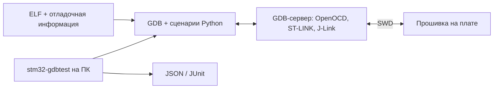

# stm32-hwtest-blackpill

[English](README.en.md)

Демонстрационный проект [stm32-gdbtest](https://github.com/ViacheslavMezentsev/stm32-gdbtest):
проверка работающей прошивки на плате WeAct BlackPill (STM32F411CE и STM32F401CC) через GDB и
SWD-отладчик сценариями на Python — метод DDTT (Debugger-Driven Testing on Target).
Тестового кода в прошивке нет.

Прошивка намеренно простая: `setup()` настраивает ADC с DMA, RTC и TIM2, `loop()` раз в 500 мс
измеряет температуру кристалла и VDDA по заводским калибровкам, перепланирует alarm RTC, мигает
светодиодом и засыпает в WFI. Из библиотек — только CMSIS.


```mermaid
flowchart LR
    E["ELF + отладочная информация"] --> G["GDB + сценарии Python"]
    R["stm32-gdbtest на ПК"] --> G
    G <--> S["GDB-сервер: OpenOCD, ST-LINK, J-Link"]
    S <-->|SWD| M["Прошивка на плате"]
    R --> J["JSON / JUnit"]
```

## Платы

| Профиль (`BOARD`) | Плата | MCU | Flash / RAM | Светодиод |
| --- | --- | --- | --- | --- |
| `F411CE` | [WeAct BlackPill](https://github.com/WeActStudio/WeActStudio.MiniSTM32F4x1) V3.1 | STM32F411CEU6 | 512 / 128 КиБ | PC13, горит при 0 |
| `F401CC` | WeAct BlackPill v3.0 | STM32F401CCU6 | 256 / 64 КиБ | PC13, горит при 0 |

Нужны только SWD, питание и земля: UART и внешняя проводка не используются. Отладчик выбирается
по серийному номеру в файле стенда.

## Требования (Windows)

- [xPack GNU Arm Embedded GCC 13.3.1-1.1](https://github.com/xpack-dev-tools/arm-none-eabi-gcc-xpack/releases/tag/v13.3.1-1.1),
  распакованный в `%USERPROFILE%\xpack-arm-none-eabi-gcc-13.3.1-1.1`, или путь в переменной
  `ARM_TOOLCHAIN_ROOT` (Linux по умолчанию — `/opt/xpack-arm-none-eabi-gcc-13.3.1-1.1`);
- CMake ≥ 3.25 и Ninja в `PATH`;
- для HIL-тестов — Python ≥ 3.11 и ST-Link с OpenOCD (или J-Link);
- VS Code с расширениями CMake Tools, C/C++ и Cortex-Debug (необязательно).

## Получение и сборка

```powershell
git clone --recursive https://github.com/ViacheslavMezentsev/stm32-hwtest-blackpill.git
cd stm32-hwtest-blackpill
cmake --preset Debug_F411CE
cmake --build --preset Debug_F411CE
```

Если репозиторий клонирован без `--recursive`: `git submodule update --init`.

| Пресет | Назначение |
| --- | --- |
| `Debug_F411CE`, `Release_F411CE` | сборка для F411CE (`build/<пресет>`) |
| `Debug_F401CC`, `Release_F401CC` | сборка для F401CC |
| `HIL_F411CE`, `HIL_F401CC` | Debug-сборка с HIL-тестами stm32-gdbtest |

Тестовые пресеты: `HIL_*-host` и `HIL_*-hw`. Результат: `build/<пресет>/` — ELF, HEX и BIN
(промежутки BIN заполнены 0xFF). Для каждой платы и toolchain — свой каталог сборки.

## Приложение

- ADC1 сканирует датчик температуры (канал 18 у F411, 16 у F401) и VREFINT (17), DMA2 stream 0
  переносит два отсчёта; VDDA и температура считаются по заводским калибровкам.
- TIM2 переполняется каждые 100 мс, RTC от LSI будит приложение alarm через две секунды.
- `app_idle()` спит в обычном WFI (не Stop), SysTick 1 мс — от HSI 16 МГц.

Остановки GDB меняют тайминги, тесты сна не измеряют ток, калибровочные векторы проверяют
арифметику, а не точность температуры.

## HIL-тесты

Сценарии в `hil/tests/board` (stm32-gdbtest v0.3.0, 21 сценарий) проверяют прошивку на плате:
запуск и тактирование, светодиод, профиль прогона, ADC и DMA (конфигурация, публикация, кто
считает измерения, серия измерений), TIM2 и RTC, сон WFI, а также реакцию на инъекции — отказы
ADC и DMA, подменённые отсчёты и калибровки, потерянный обратный вызов, невыполнимое ожидание LSI.
Плату описывают описание MCU и файл данных платы, общие для всех сценариев. Без платы проверяются
трассировка требований и подготовка запуска (`ctest --preset HIL_F411CE-host`); на плате —
`ctest --preset HIL_F411CE-hw` после настройки стенда. Подробно: [hil/README.md](hil/README.md).

Последний аппаратный прогон: F411CE и F401CC через ST-Link/OpenOCD — по 21/21 PASS.

## Структура

```text
src/            прошивка: main, setup/loop, платформа (CMSIS), арифметика ADC
cmsis/          заголовки CMSIS (без изменений)
ld/             скрипт компоновщика (Flash и RAM — по плате)
cmake/          toolchain и подключение HIL
hil/            конфигурации прогона, описания MCU, данные плат, сценарии и требования, стенды
modules/        stm32-gdbtest (Git-подмодуль)
ci/             offline-проверки в Docker: сборка, подготовка сценариев, арифметика ADC
resources/      SVD для отладки в VS Code
docs/history/   история проекта, из которого выделен stm32-gdbtest
archive/        сохранённые материалы: прежние HAL-исходники, примеры K1921 и H503, опыты
.claude/skills/ навыки агентов stm32-gdbtest
.vscode/        задачи, конфигурации отладки, настройки
.github/        GitHub Actions: offline-проверки
```

## Документация

- stm32-gdbtest v0.3.0: [README](https://github.com/ViacheslavMezentsev/stm32-gdbtest/blob/v0.3.0/README.md), [справочник API](https://github.com/ViacheslavMezentsev/stm32-gdbtest/blob/v0.3.0/docs/ru/api/index.md),
  [техники тестирования](https://github.com/ViacheslavMezentsev/stm32-gdbtest/blob/v0.3.0/docs/ru/TESTING_TECHNIQUES.md), [навыки агентов](https://github.com/ViacheslavMezentsev/stm32-gdbtest/blob/v0.3.0/skills/README.md).
- Этот проект: [HIL-тесты](hil/README.md), [требования](hil/tests/requirements.md),
  [изменения](CHANGELOG.md), [правила разработки](AGENTS.md).
- [История](docs/history/README.md): проект начинался с опытов на HAL с несколькими STM32, из
  него выделен модуль stm32-gdbtest; протоколы, архитектура и планы того периода сохранены.
- Аналогичный пример: [stm32-hwtest-bluepill](https://github.com/ViacheslavMezentsev/stm32-hwtest-bluepill).

## Лицензия

MIT ([LICENSE](LICENSE)). Файлы `cmsis/` — сторонний код Arm и STMicroelectronics с их лицензиями
([cmsis/README.md](cmsis/README.md)).
