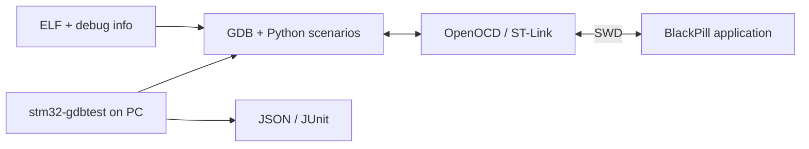

# stm32-hwtest-blackpill

[English](README.en.md)

Пример проверки работающей прошивки WeAct BlackPill через **GDB-Python и SWD**.
Отдельный модуль [stm32-gdbtest](https://github.com/ViacheslavMezentsev/stm32-gdbtest)
запускает Python-сценарии на ПК: они останавливают MCU, читают переменные и
регистры, проверяют результаты и вводят ошибки. Тестовые hooks в прошивку не добавляются.

Проект вырос из опытов с HAL на нескольких STM32. Общий механизм и минимальные
примеры разных MCU выделены в stm32-gdbtest; здесь развивается самостоятельное
CMSIS-приложение для двух BlackPill. Старые HAL-исходники сохранены в [справочном архиве](legacy/hal/README.md);
их результаты не следует смешивать с CMSIS.


```mermaid
flowchart LR
    E["ELF + debug info"] --> G["GDB + Python scenarios"]
    R["stm32-gdbtest on PC"] --> G
    G <--> S["OpenOCD / ST-Link"]
    S <-->|SWD| M["BlackPill application"]
    R --> J["JSON / JUnit"]
```

## Платы и приложение

| Профиль | MCU | Flash / RAM | LED |
| --- | --- | --- | --- |
| F411CE | STM32F411CEU6, WeAct BlackPill V3.1 | 512 / 128 КиБ | PC13, active-low |
| F401CC | STM32F401CCU6, BlackPill v3.0 | 256 / 64 КиБ | PC13, active-low |

[Проект плат WeAct](https://github.com/WeActStudio/WeActStudio.MiniSTM32F4x1).
Приложение мигает LED, измеряет внутренние temperature/VREFINT через ADC/DMA,
обрабатывает TIM2 и RTC и использует Sleep/WFI. UART и внешняя проводка периферии
не требуются. SWD, питание и земля должны быть подключены; отладчик выбирается
явно по serial. Несовпадение DEV_ID не расширяет заданный размер памяти.

## Сборка

Нужны Git, CMake 3.25+, Ninja и GNU Arm GCC; проверен xPack 13.3.1-1.1.
CMSIS-заголовки включены в репозиторий, CubeMX для новой сборки не нужен.
Для HIL дополнительно нужны Python 3.11+, GDB с Python и OpenOCD/ST-Link.

```sh
git clone --recurse-submodules https://github.com/ViacheslavMezentsev/stm32-hwtest-blackpill.git
cd stm32-hwtest-blackpill
cmake --preset Debug_F411CE
cmake --build --preset Debug_F411CE
```

Путь к GCC: переменная `ARM_TOOLCHAIN_ROOT` либо одноимённый CMake cache.
По умолчанию Windows использует `%USERPROFILE%/xpack-arm-none-eabi-gcc-13.3.1-1.1`,
Linux — `/opt/xpack-arm-none-eabi-gcc-13.3.1-1.1`. Для разных MCU/toolchain нужны
разные build-каталоги. ELF, HEX и BIN находятся в `build/<preset>/`; gaps BIN
заполняются 0xFF, но загрузка ELF не гарантирует состояние gaps в памяти MCU.

| Назначение | F411CE | F401CC |
| --- | --- | --- |
| Отладка | Debug_F411CE | Debug_F401CC |
| Оптимизация размера | Release_F411CE | Release_F401CC |
| Сценарии GDB и prepare | HIL_F411CE | HIL_F401CC |

## Тестирование

```sh
cmake --preset HIL_F411CE
cmake --build --preset HIL_F411CE
ctest --preset HIL_F411CE-host
```

Это подготовка без оборудования. Для аппаратного запуска скопируйте
`hil/stands/f411ce.example.toml` в `hil/stands/f411ce.local.toml`, задайте serial
и путь к OpenOCD, затем выполните `ctest --preset HIL_F411CE-hw`.
Для F401CC замените профиль и файл стенда соответственно. Не запускайте VS Code
и тестовый runner одновременно с одним отладчиком. Конфигурации VS Code запрашивают
serial и выбирают соответствующий SVD. Подробности — [HIL](hil/README.md).

## Ограничения и документация

GDB-остановки меняют тайминги; Sleep-тесты не измеряют ток. Калибровочные векторы
проверяют арифметику, а не точность температуры. Сценарии требуют понимания GDB,
текущего frame и доступности макросов при `-g3`; произвольный C/C++ код нельзя
считать свободно исполнимым в выражениях отладчика. Renode/QEMU для этих F4 здесь
пока не проверены. CI build/prepare не заменяет аппаратный запуск.

- [Текущий статус](docs/STATUS.md), [CMSIS-приёмка](docs/BLACKPILL_CMSIS_APPLICATION.md), [CI](docs/CI.md).
- [Документация и история](docs/README.md), [архитектура](docs/HWTEST_ARCHITECTURE_V2.md), [план](TODO.md).
- `src/` — приложение; `cmsis/` — сторонние заголовки; `ld/`, `cmake/` — сборка; `hil/` — профили и тесты.
- [Аналогичный BluePill-пример](https://github.com/ViacheslavMezentsev/stm32-hwtest-bluepill), [stm32-cmake-yml](https://github.com/ViacheslavMezentsev/stm32-cmake-yml).

Собственный код — [MIT](LICENSE); CMSIS имеет отдельные [лицензии и происхождение](cmsis/README.md).
