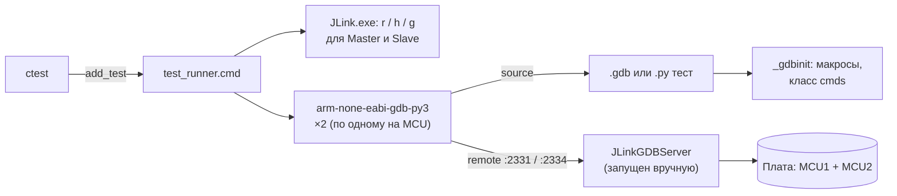
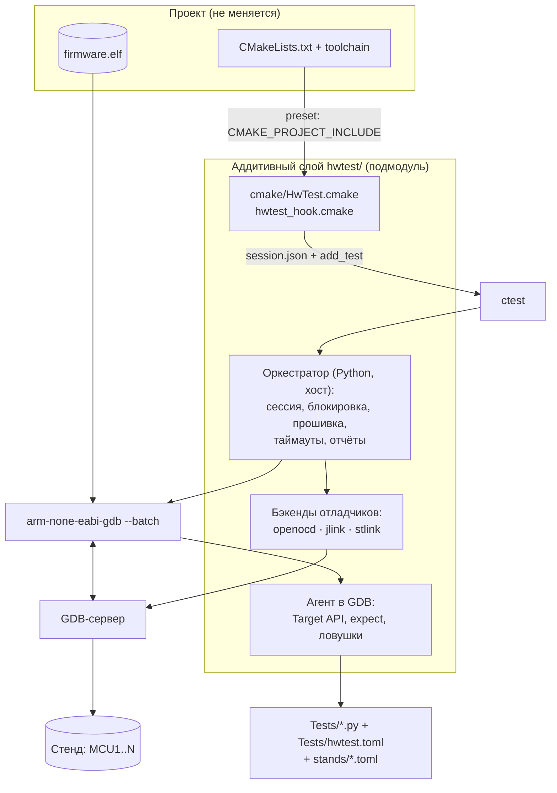
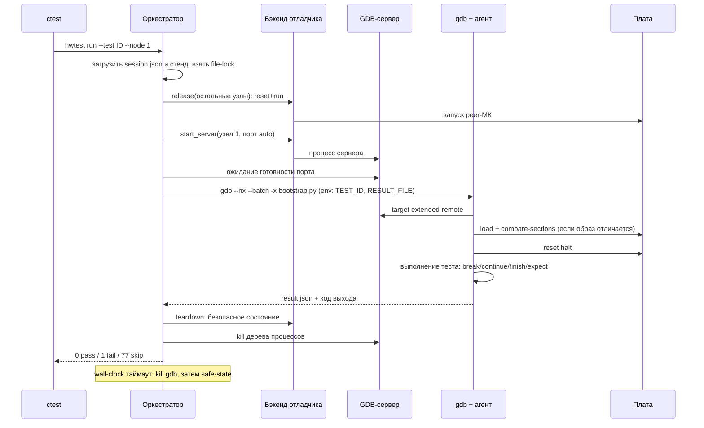

# Неинвазивное board-тестирование STM32 через GDB-Python: разбор и архитектурный рефакторинг

> Уточнение переносимости: общее GDB API не унифицирует HAL/CMSIS и периферию.
> Актуальные требования к manifest версий, MCU/HAL-адаптерам и предварительным
> проверкам описаны в [COMPATIBILITY.md](COMPATIBILITY.md). Это план расширения;
> существующая минимальная реализация не выполняет все эти проверки автоматически.


> Область: проекты STM32 на CMake (`stm32-cmake`), платы подключены к ПК-сборщику через ST-Link v2 и/или J-Link.
> Основа анализа: файлы проекта `99_BOARD_TEST` (`test_runner.cmd`, `_gdbinit`, `*.gdb`, `*.py`, `CMakeLists.txt`, `CMakePresets.json`, `tree.txt`, `*_XX.md`).
> Не были доступны: исходники `Core/Src/*.c`, `CMakeLists.txt` наборов `BOARD_TEST_02/03/10`, `.c`-файлы Unity-режима. Выводы про них сделаны по `tree.txt` и по корневому `CMakeLists.txt`.
> **Важно:** код в приложениях и командные строки отладчиков — проектные скелеты, они не запускались на железе. Флаги внешних утилит нужно сверить с `--help` установленных версий (см. раздел 9).

---

## Содержание

1. [Резюме](#1-резюме)
2. [Разбор текущего решения](#2-разбор-текущего-решения)
3. [Цели и принципы новой архитектуры](#3-цели-и-принципы-новой-архитектуры)
4. [Целевая архитектура](#4-целевая-архитектура)
5. [Встраивание в CMake-проект (аддитивно)](#5-встраивание-в-cmake-проект-аддитивно)
6. [Отладчики: J-Link, ST-Link, OpenOCD](#6-отладчики-j-link-st-link-openocd)
7. [Ограничения железа и безопасность стенда](#7-ограничения-железа-и-безопасность-стенда)
8. [CI и план миграции](#8-ci-и-план-миграции)
9. [Риски и что проверить](#9-риски-и-что-проверить)
10. [Приложения (скелеты кода)](#10-приложения-скелеты-кода)

---

## 1. Резюме

**Что в текущем подходе хорошо и это стоит сохранить:**

- Тесты **неинвазивны**: в прошивку не добавляется тестовый код, проверяются реальные бинарник и поведение на железе.
- Есть сквозная **трассируемость**: ID требования (LLR) = имя теста = имя файла = имя теста в CTest.
- Удачны приёмы **инъекции отказов на лету**: `set hadc = NULL` (естественный путь ошибки HAL) и `return HAL_ERROR` (принудительная ошибка вызова).
- Интеграция с CTest даёт единый вход `ctest` и код возврата.

**Что мешает переиспользованию (главное):**

| # | Проблема | Следствие |
| --- | ---------- | ----------- |
| 1 | Всё привязано к Windows (`.cmd`, `%UserProfile%`, `JLink.exe`) | Нет Linux/CI |
| 2 | Всё привязано к J-Link (`JLinkGDBServer`, `JLink.exe`, `JRun`, `monitor go`) | ST-Link не поддержан |
| 3 | Серийные номера, порты, имя устройства, пути зашиты в 4–5 местах | Нельзя перенести на другой стенд/проект |
| 4 | Тесты идут против ELF, а в МК лежит то, что залили вручную | Возможны ложные результаты |
| 5 | Диагностика отсутствует (`--batch-silent`, `2> nul`, `except: result=False`) | Падение теста нечем разбирать |
| 6 | Логика теста дублируется в `.gdb` и `.py` | Дрейф двух реализаций |
| 7 | CMake-код размножен копипастой по 4 наборам, списки тестов ручные | Дорого расширять |

**Предлагаемое решение в одной фразе:** вынести всё, что не зависит от проекта, в самодостаточный каталог `hwtest/` (подмодуль git) и подключать его к любому CMake-проекту **без правки его `CMakeLists.txt`** (через `CMAKE_PROJECT_INCLUDE` + `cmake_language(DEFER)`) либо тремя строками. Архитектура из четырёх слоёв:

1. **CMake-слой** генерирует конфигурацию сессии и регистрирует тесты в CTest.
2. **Оркестратор** (Python на хосте) управляет GDB-сервером, прошивкой, таймаутами, блокировкой стенда, логами и JUnit.
3. **Бэкенды отладчиков** (`jlink` / `stlink` / `openocd`) прячут различия серверов и диалектов `monitor`.
4. **Агент внутри GDB** даёт тестам чистый Python-API (`Target`, `expect`) вместо макросов `_gdbinit`.

Тесты пишутся **только на Python**, стенд описывается **конфигом стенда** (TOML), а не кодом.

---

## 2. Разбор текущего решения

### 2.1. Состав и поток выполнения



Последовательность для одного теста (`test_runner.cmd`):

1. Ищется GDB с Python перебором зашитого списка версий xPack.
2. Выбирается скрипт `.gdb` или `.py` (по аргументу `%3` из CMake).
3. J-Link Commander сбрасывает и запускает оба МК (`r; h; g; q`) по «USB Master/Slave».
4. GDB запускается **дважды подряд**: `set $mcu=1`, затем `set $mcu=2`; тест выполняется на каждом МК.
5. Ошибка GDB (stderr) гасится, код выхода `!$result` пробрасывается в CTest.

CMake: `ENABLE_UNIT_TESTING` включает ветку тестов. `TEST_FRAMEWORK=Unity` — инвазивный режим (тестовый `.c` добавляется в прошивку, RTT + `JRun`). Иначе `TEST_SCRIPT_TYPE=GDB|GDB-PY` — неинвазивный режим (наш предмет). Для каждого LLR регистрируется `add_test(<ID> test_runner.cmd <elf> <путь-без-расширения> .gdb|.py)`.

### 2.2. Сильные стороны (сохраняем как принципы)

| Что | Почему ценно |
| ----- | -------------- |
| Тесты не входят в прошивку | Проверяется именно поставляемый код |
| Имя теста = LLR ID | Прямая трассируемость требование → тест → результат |
| Инъекция отказа `set hadc = NULL` | Использует штатную защиту функции, минимум вмешательства |
| Инъекция `return HAL_ERROR` + `finish` | Позволяет достичь недостижимых на железе ветвей |
| Тест-скрипт в `try/finally` с отключением | Стенд не остаётся в подвешенном состоянии |
| Отдельные конфигурации в `CMakePresets.json` | Переключение режимов без ручных флагов |
| Проверка `RemoteTargetConnection` в `finally` | Корректный выход, даже если подключения не было |

### 2.3. Проблемы (архитектурные)

| ID | Проблема | Где проявляется | Тяжесть |
| ---- | ---------- | ----------------- | --------- |
| P1 | Только Windows | `test_runner.cmd`, `configure.cmd`, `build.cmd` | Высокая |
| P2 | Только J-Link | `run_mcu`, `JLink.exe`, `JRun`, порты `2331/2334`, `monitor go` | Высокая |
| P3 | Зашитые идентификаторы (SN, порты, устройство, пути) | `_gdbinit`, `test_runner.cmd`, `BOARD_TEST_01/CMakeLists.txt` (`--usb 661050098`), корневой `CMakeLists.txt` (`build/debug`) | Высокая |
| P4 | Жизненный цикл GDB-сервера не управляется («Вариант 2» — стартовать вручную) | `test_runner.cmd` | Высокая |
| P5 | Нет прошивки и проверки соответствия образа (комментарий «загрузить вручную») | `CMakeLists.txt`: `TEST_EXECUTABLE` | Высокая |
| P6 | Дублирование `.gdb`/`.py` | `Tests/BBC_SW_LLR/*` | Средняя |
| P7 | Нет диагностики: `--batch-silent`, `2> nul`, `except Exception: result=False`, единый `all()` без указания, какое поле неверно | `test_runner.cmd`, `*.py` | Высокая |
| P8 | Таймауты хрупкие (см. D3) | `break_main_and_set_timeout`, `TIMEOUT 5` | Средняя |
| P9 | Копипаста CMake: 4 набора, ручные `TestList`, в Unity-ветке зарегистрирован лишь `01_01` | `Tests/*/CMakeLists.txt` | Средняя |
| P10 | Неявные связи через scope CMake: `TEST_EXECUTABLE`, `GDB_TEST_RUNNER`, `MCU`, `PROJECT_NAME` читаются из родителя | все `CMakeLists.txt` наборов | Средняя |
| P11 | Нет блокировки стенда, `ctest -j` сломает стенд (общие порты и отладчики) | `add_test` без `RESOURCE_LOCK` | Средняя |
| P12 | Нет машинных отчётов (JUnit/JSON), нет автоматической проверки трассируемости | — | Средняя |
| P13 | Оптимизация `-O2` в Debug + тесты, читающие параметры функций | `target_compile_options` | Средняя |
| P14 | Не определено безопасное состояние силовой части после теста/аварии | — | Высокая для силовых стендов |
| P15 | Логика в GDB-DSL (`define … end`) и костыль `cmds` (разбор по `;`) | `_gdbinit` | Низкая |

### 2.4. Найденные дефекты в конкретных файлах

**D1. Вероятная ошибка в `run_mcu` (`_gdbinit`).**
`$arg0` подставляется текстом в теле `define`, а внутри строки `gdb.convenience_variable( 'arg0' )` подстановки нет. Скорее всего, `convenience_variable('arg0')` вернёт `None`, условие `== 1` всегда ложно, и порт всегда `2334`. Для `run_mcu 2` это совпадает с задумкой «случайно», а `run_mcu 1` (ветка `$mcu == 2`) подключится к тому же `2334`, а не к `2331`. Тогда МК1 не запускается. Проверьте на стенде (для случая `$mcu == 2`).

**D2. Копипаст в комментариях `connect_both_mcu`.** В ветке `$mcu == 2` комментарий «Подключаемся к MCU1», хотя подключение идёт к `2334` (MCU2). Побочный признак того, что макросы правились копированием.

**D3. Единицы таймаута.** `break_main_and_set_timeout 5` ставит `watch uwTick > $uwTick + 5`. При тике HAL 1 мс это **5 мс** времени исполнения прошивки. CTest `TIMEOUT 5` — это **5 секунд** на весь запуск (два МК, старт GDB, J-Link Commander). Если задумывалось 5 секунд в обоих случаях, единицы не совпадают. Если тик остановится (HardFault, `__disable_irq`), watchpoint не сработает, останется только CTest-таймаут, а он не гарантирует завершения дочерних `gdb`/сервера.

**D4. `set auto-load safe-path /`.** Разрешает автозагрузку `.gdbinit`/скриптов отовсюду. Для тестового раннера это лишний риск. Правильнее `--nx` + явный `-x`.

**D5. Тихие исключения в `.py`.** `except Exception as ex: result False` без вывода `ex`, плюс `2> nul` в раннере. Причина падения (нет символа, оптимизирован параметр, разрыв связи) никогда не будет видна.

**D6. Расхождения в тексте требований (`*_XX.md`).**

- `01_02`: «`HAL_ADC1_Init()`» — такой функции нет, должно быть `HAL_ADC_Init()`; «функция `HAL_ADC_Init()` должна вызвать `Error_Handler()`» — по коду теста проверяется поведение `MX_ADC1_Init()`.
- `01_03`, `01_04`: субъект «должна вызвать `Error_Handler()`» приписан `HAL_ADCEx_MultiModeConfigChannel()` / `HAL_ADC1_Init()`, а проверяется `MX_ADC1_Init()`.
- `02_XX`: требования про `CAN1`/`hcan1`, но в `tree.txt` нет `can.c/can.h` и `stm32f3xx_hal_can.*`. Убедитесь, что набор `BOARD_TEST_02` относится к этому проекту.

**D7. Тесты зависят от оптимизации.** В Debug стоит `-O2 -g3`. Условия вида `hadc == & hadc1`, `multimode->Mode` и `set hadc = NULL` на входе функции обычно работают (GDB читает location lists), но после `finish`/внутри тела значения могут оказаться `<optimized out>`. Тест при этом «падает» без объяснения (см. D5).

**D8. Образ в МК не проверяется** (P5): ELF используется только для символов. Если ELF пересобран, а прошивка не залита, тест пройдёт/упадёт по устаревшему образу.

**D9. Точки останова.** `break main` не удаляется (не `tbreak`), плюс `Error_Handler`, плюс целевая функция, плюс watchpoint. Cortex-M4 (F334) имеет 6 FPB-компараторов кода и 4 DWT-компаратора. Пока запас есть (тесты 01_XX используют ≤ 3–4), но тесты сложнее упрутся в лимит, и GDB выдаст малопонятную ошибку.

---

## 3. Цели и принципы новой архитектуры

| Принцип | Что означает на практике |
| --------- | -------------------------- |
| **Аддитивность** | Проект получает один каталог `hwtest/`, один файл конфигурации `Tests/hwtest.toml` и запись в `CMakePresets.json`. Файлы прошивки и её `CMakeLists.txt` не правятся (Level 0) либо получают 3–5 строк (Level 1) |
| **Неинвазивность** | В прошивку ничего не линкуется. Для тестов нужен только `-g` (а для C-макросов `-g3`) |
| **Независимость от отладчика** | Один тест работает на J-Link и ST-Link. Различия только в бэкенде |
| **Независимость от ОС** | Оркестратор на Python, без `.cmd`. Windows / Linux / macOS |
| **Конфигурация ≠ код** | Отладчики, серийные номера, порты — в описании стенда, не в скриптах и не в CMake |
| **Один язык тестов** | Только Python. `.gdb` в тестах не используем |
| **Диагностируемость** | Каждый запуск оставляет лог GDB, JSON-результат с ожидаемым/фактическим по каждой проверке и JUnit |
| **Детерминизм** | Образ прошит и верифицирован до теста. Каждый тест стартует со сброса |
| **Безопасность стенда** | Есть хук «безопасного состояния» при любом завершении теста |
| **Расширяемость** | Новый проект = новый `hwtest.toml` + свои тесты. Ядро не трогаем |

---

## 4. Целевая архитектура

### 4.1. Слои



**Разделение ответственности**

| Слой | Знает про | Не знает про |
| ------ | ----------- | -------------- |
| CMake-слой | ELF-цель, список тестов, метки, таймауты | Отладчики, серийные номера |
| Оркестратор | Стенд, отладчики, жизненный цикл процессов | Логику конкретных тестов |
| Бэкенд | Командные строки и диалект `monitor` одного отладчика | Проект, тесты |
| Агент | GDB Python API, символы прошивки | Как запущен сервер |
| Тесты | Требования и поведение прошивки | Всё остальное |

### 4.2. Структура репозитория

```text
<project>/
├─ hwtest/                        # git submodule, независим от проекта
│  ├─ cmake/
│  │  ├─ HwTest.cmake             # hwtest_attach(), поиск gdb, генерация session.json
│  │  └─ hwtest_hook.cmake        # для CMAKE_PROJECT_INCLUDE (Level 0)
│  ├─ python/hwtest/
│  │  ├─ cli.py                   # hwtest run | flash | collect | trace | probes
│  │  ├─ session.py               # чтение session.json, стенда, проекта
│  │  ├─ orchestrator.py          # сервер → gdb → отчёт, таймауты, kill-tree
│  │  ├─ probes/{base,jlink,stlink,openocd}.py
│  │  ├─ report.py                # JSON, JUnit, трассируемость
│  │  ├─ collect.py               # разбор тестов через ast (без gdb)
│  │  └─ agent/                   # исполняется ВНУТРИ gdb
│  │     ├─ bootstrap.py, target.py, expect.py, traps.py, compat.py
│  └─ docs/
├─ Tests/
│  ├─ hwtest.toml                 # проектная конфигурация
│  ├─ stands/                     # описание стендов (можно вне репо)
│  │  ├─ bench-jlink.toml
│  │  └─ bench-stlink.toml
│  ├─ requirements/*.md           # тексты LLR (как сейчас *_XX.md)
│  └─ BBC_SW_LLR/BOARD_TEST_01/test_adc_init.py
└─ CMakePresets.json              # + один preset (Level 0)
```

Каталоги `.gdb`, `_gdbinit`, `test_runner.cmd` в целевой схеме не нужны (используются на переходном этапе, см. раздел 8).

### 4.3. Поток выполнения одного теста



### 4.4. Модель стенда

Стенд — это набор **узлов** (`node` = один МК под одним отладчиком). Тест объявляет, на каких узлах он выполняется (как сегодняшний `for %%n in (1,2)`). Отладчики могут быть **разными** на разных узлах.

```toml
# Tests/stands/bench-mixed.toml
[stand]
name = "bench-mixed"
host = "127.0.0.1"
teardown = "reset_halt"      # reset_halt | reset_run | none

[[node]]
id = 1
role = "master"
probe = "jlink"              # jlink | stlink | openocd
serial = "601012345"
speed_khz = 4000
port = "auto"                # или число

[[node]]
id = 2
role = "slave"
probe = "stlink"
serial = "066DFF303535..."
speed_khz = 1800
```

Что выбирается во время выполнения:

- стенд: переменная `HWTEST_STAND=bench-mixed` (или `--stand`);
- каталог стендов: `HWTEST_STANDS_DIR` (по умолчанию `Tests/stands`; на CI можно вне репозитория);
- серийные номера в репозиторий не обязательно коммитить (файл стенда может лежать на машине-раннере).

Проектная конфигурация (общая для всех стендов):

```toml
# Tests/hwtest.toml
[project]
device      = "STM32F334C8"
svd         = "STM32F3x4.svd"
tick_symbol = "uwTick"                 # для модельного таймаута (опционально)
main_symbol = "main"

[gdb]
# порядок поиска: HWTEST_GDB → рядом с CMAKE_C_COMPILER → PATH
candidates  = ["arm-none-eabi-gdb-py3", "arm-none-eabi-gdb-py", "arm-none-eabi-gdb", "gdb-multiarch"]

[traps]                                # автоматические ловушки аварий
faults = ["HardFault_Handler", "MemManage_Handler", "BusFault_Handler", "UsageFault_Handler"]

[init]                                 # записи после reset halt (безопасность и отладка)
writes = [
  # заморозка IWDG при останове ядра. Адрес и бит свериться с RM0364
  "set *(unsigned int*)0xE0042008 |= (1u << 8)",
]

[nodes.default]
peers_boot_delay_ms = 300              # пауза после запуска peer-МК
```

### 4.5. Абстракция отладчика

Единый интерфейс, четыре операции. Всё остальное (порты, аргументы, диалект `monitor`) прячется в бэкенде.

```python
class Probe(ABC):
    def start_server(self, port: int) -> subprocess.Popen: ...   # процесс gdbserver
    def gdb_target(self, port: int) -> str: ...                  # "extended-remote 127.0.0.1:PORT"
    def monitor_reset(self, halt: bool) -> str: ...              # диалектная команда monitor
    def release(self) -> None: ...                               # reset+run без участия gdb (peer-узел)
    def probe_present(self) -> bool: ...                         # для SKIP (код 77) при отсутствии железа
```

| Операция | J-Link (`JLinkGDBServerCL`) | ST-Link (`ST-LINK_gdbserver`) | OpenOCD (ST-Link или J-Link) |
| --- | --- | --- | --- |
| Сброс с остановом | `monitor reset` | `monitor reset` (без `halt` — сервер сам) | `monitor reset halt` |
| Сброс и запуск | `monitor reset` + `monitor go` | `monitor reset` + `continue` | `monitor reset run` |
| Прошивка | `load` через GDB | `load` через GDB | `load` через GDB (или `program`) |
| Идентификация отладчика | `-select USB=<SN>` | опция серийного номера (см. `--help`) | `adapter serial <SN>` |
| `release()` | `JLink.exe` / `JLinkExe` (`r; g; q`) | `STM32_Programmer_CLI` (сброс) либо GDB-подключение | `openocd -c "init; reset run; shutdown"` |
| Дополнительно | RTT, Flash Breakpoints (лицензия) | нужна STM32CubeProgrammer | RTT через `rtt …`, единый бэкенд для обоих отладчиков |

**Рекомендация.** Реализовать **три** бэкенда, но по умолчанию использовать `openocd` как универсальный: один диалект команд, ST-Link v2 и J-Link под одним бэкендом, кроссплатформенность. Нативные `jlink`/`stlink` — для случаев, когда нужны лицензионные функции SEGGER или когда OpenOCD не устраивает по драйверам (см. раздел 6).

### 4.6. Прошивка и верификация образа

Решаем P5. Шаги (выполняются агентом при первом подключении узла или отдельной командой `hwtest flash`):

1. Считать хэш ELF (`sha256`) и сравнить с записью `build/hwtest/state.json` для `(stand, node)`.
2. Если хэш совпал и **проверка чтения** проходит, прошивку пропустить (экономия времени и ресурса Flash).
   - Проверка: `compare-sections` после `target extended-remote` (сравнивает секции ELF с содержимым МК). Для F334 (64 КБ) это быстро.
3. Если не совпало — `load`, затем `compare-sections`. Ошибка проверки → тест получает статус **ERROR (инфраструктура)**, не FAIL.
4. Сохранить хэш в `state.json`.

Дополнительно рекомендуется добавить в компоновку `-Wl,--build-id=sha1` и записывать Build-ID в отчёт: по нему протокол испытаний привязывается к конкретному бинарнику.

Один и тот же путь `load` + `compare-sections` работает для всех отладчиков через GDB-протокол, поэтому различий по прошивке между J-Link и ST-Link нет.

### 4.7. API тестов и миграция «макрос → API»

Тест — обычная Python-функция с декоратором. Метаданные читаются **статически (`ast`)**, что даёт CMake список тестов без запуска GDB.

```python
# Tests/BBC_SW_LLR/BOARD_TEST_01/test_adc_init.py
from hwtest import hwtest, expect

ADC1_INIT = {
    "Instance":                       "ADC1",
    "Init.ClockPrescaler":            "ADC_CLOCK_SYNC_PCLK_DIV4",
    "Init.Resolution":                "ADC_RESOLUTION_12B",
    "Init.ScanConvMode":              "ADC_SCAN_ENABLE",
    "Init.ContinuousConvMode":        "DISABLE",
    "Init.DiscontinuousConvMode":     "DISABLE",
    "Init.ExternalTrigConvEdge":      "ADC_EXTERNALTRIGCONVEDGE_RISING",
    "Init.ExternalTrigConv":          "ADC_EXTERNALTRIGCONVHRTIM_TRG1",
    "Init.DataAlign":                 "ADC_DATAALIGN_RIGHT",
    "Init.NbrOfConversion":           "4",
    "Init.DMAContinuousRequests":     "ENABLE",
    "Init.EOCSelection":              "ADC_EOC_SEQ_CONV",
    "Init.LowPowerAutoWait":          "DISABLE",
    "Init.Overrun":                   "ADC_OVR_DATA_OVERWRITTEN",
}

@hwtest("BBC_SW_LLR_BOARD_TEST_01_01", nodes=(1, 2), timeout_s=10, labels=("adc", "init"))
def adc1_init_fields(t):
    t.boot_to("main")
    t.run_function("MX_ADC1_Init")             # break + continue + finish
    expect.fields(t, "hadc1", ADC1_INIT)       # на ошибке: «Init.Resolution: ожидалось X, получено Y»

@hwtest("BBC_SW_LLR_BOARD_TEST_01_02", nodes=(1, 2), timeout_s=10, labels=("adc", "error"))
def adc_init_error_path(t):
    t.boot_to("main")
    t.break_at("HAL_ADC_Init", when="hadc == &hadc1").run()
    t.set("hadc", "NULL")                      # естественная инъекция отказа
    t.expect_reaches("Error_Handler", timeout_s=1)

@hwtest("BBC_SW_LLR_BOARD_TEST_01_03", nodes=(1, 2), timeout_s=10, labels=("adc", "error"))
def adc_multimode_error(t):
    t.boot_to("main")
    t.break_at("HAL_ADCEx_MultiModeConfigChannel",
               when="hadc == &hadc1 && multimode->Mode == ADC_MODE_INDEPENDENT").run()
    expect.fields(t, "*multimode", {"Mode": "ADC_MODE_INDEPENDENT"})
    t.force_return("HAL_ERROR")               # return + finish
    t.expect_reaches("Error_Handler", timeout_s=1)
```

Соответствие старого нового:

| Было (`_gdbinit` / скрипты) | Стало |
| --- | --- |
| `connect_both_mcu`, `cmds connect_both_mcu` | автоматически, по `nodes=(…)` и описанию стенда |
| `set $result = false` | не нужно: статус выводится из проверок и исключений |
| `break_main_and_set_timeout 5` | `t.boot_to("main")` + wall-clock `timeout_s` (+ опционально модельный `tick_timeout_ms`) |
| `break X; continue; finish` | `t.run_function("X")` |
| `break X if cond; continue` | `t.break_at("X", when="cond").run()` |
| `set $result = $init.Field == …` цепочка `&&` | `expect.fields(t, "hadc1", {...})` |
| `$_caller_is("Error_Handler", 0)` | `t.expect_reaches("Error_Handler")` / `expect.in_function(t, "Error_Handler")` |
| `return HAL_ERROR; finish` | `t.force_return("HAL_ERROR")` |
| `disconnect_and_quit` | автоматический teardown и код выхода |
| `cmds …` | не нужен (Python вызывает `gdb.execute` напрямую) |
| `macro define true/false` | не нужен |

Правила тест-дизайна (важны для устойчивости к оптимизации, см. D7):

- Проверять **глобальные объекты** (`hadc1`), **параметры на входе функции** и **факт вызова/возврата**.
- Не опираться на локальные переменные внутри тела оптимизированных функций.
- Для инъекции отказа предпочитать естественный путь ошибки (как `hadc = NULL`) и лишь затем `force_return`.
- Не более 3–4 одновременно активных аппаратных точек останова (агент считает и предупреждает).

### 4.8. Таймауты, ловушки, безопасное состояние

Три независимых уровня защиты:

1. **Wall-clock (оркестратор)**: главный. По истечении убивается дерево процессов `gdb` + сервер (Windows: Job Object; Linux: process group), затем выполняется `teardown`. Работает, даже если тик остановился.
2. **Модельное время (агент, опционально)**: `watch tick_symbol > start + N`. Оставлено для тестов «за N мс прошивка должна дойти до X». В документации явно указывать единицы (мс тика).
3. **Ловушки аварий (агент)**: на старте автоматически ставятся точки на `HardFault_Handler` и др. (список в `hwtest.toml`). Их срабатывание — немедленный FAIL с дампом `CFSR/HFSR/PC/LR`, если тест сам не объявил `expect_fault=True`.

**Teardown** (всегда, в `finally` на обоих уровнях): по настройке стенда — `reset_halt` / `reset_run` / `none`. `reset_halt` рекомендуется для силовых плат (см. раздел 7).

### 4.9. Результаты и отчётность

На каждый запуск в `build/<preset>/hwtest/`:

```text
logs/<test>.<node>.gdb.log       # весь вывод gdb (stdout+stderr, без ANSI)
logs/<test>.<node>.server.log    # вывод сервера
results/<test>.<node>.json       # статус, проверки (ожидалось/получено), длительность, build-id
junit/<test>.<node>.xml          # для CI
state.json                       # хэши образов, время последней прошивки
```

Коды выхода:

| Код | Смысл | CTest |
| --- | --- | --- |
| 0 | PASS | Passed |
| 1 | FAIL (проверка не выполнена) | Failed |
| 2 | ERROR (инфраструктура: нет связи, не прошилось, сервер не стартовал) | Failed |
| 77 | SKIP (нет железа или стенд не выбран) | Skipped (через `SKIP_RETURN_CODE 77`) |

Трассируемость: `hwtest trace` сравнивает требования из `Tests/requirements/*.md` со списком тестов (ID есть в требованиях, но нет теста / есть тест без требования). Запускается как отдельный CTest-тест `hwtest.traceability` (без железа).

---

## 5. Встраивание в CMake-проект (аддитивно)

### 5.1. Уровни вмешательства

| Уровень | Что меняется в проекте | Когда использовать |
| --- | --- | --- |
| **Level 0 (ноль строк)** | Только `CMakePresets.json` (+1 preset) и новые каталоги | Хочется гарантированно не трогать существующий `CMakeLists.txt` |
| **Level 1 (3–5 строк)** | В корневой `CMakeLists.txt` после `add_executable` | Нужна явная видимость интеграции, старый CMake < 3.19 неактуален |
| **Level 2 (опционально)** | Флаги компиляции для отладочной информации | Если `-g3` не задан в конфигурации |

Требования: CMake ≥ 3.19 (Level 0 использует `cmake_language(DEFER)`); в вашем проекте `cmake_minimum_required(VERSION 3.19)`, подходит.

### 5.2. Level 0: без правок `CMakeLists.txt`

Добавляется preset (наследует ваш `debug`):

```json
{
  "name": "debug-hwtest",
  "displayName": "Debug + board tests (hwtest)",
  "inherits": "debug",
  "cacheVariables": {
    "ENABLE_HW_TESTING": "ON",
    "CMAKE_PROJECT_INCLUDE": "${sourceDir}/hwtest/cmake/hwtest_hook.cmake",
    "HWTEST_TESTS_DIR": "${sourceDir}/Tests/BBC_SW_LLR",
    "HWTEST_CONFIG":    "${sourceDir}/Tests/hwtest.toml"
  }
}
```

`CMAKE_PROJECT_INCLUDE` подгружается CMake сразу после `project()`. На этом этапе цель прошивки ещё **не создана**, поэтому хук откладывает подключение до конца обработки корневого каталога:

```cmake
# hwtest/cmake/hwtest_hook.cmake
include_guard(GLOBAL)
if(NOT ENABLE_HW_TESTING)
  return()
endif()
if(NOT CMAKE_SOURCE_DIR STREQUAL PROJECT_SOURCE_DIR)   # только корневой project()
  return()
endif()

include("${CMAKE_CURRENT_LIST_DIR}/HwTest.cmake")

# Выполнится после завершения корневого CMakeLists.txt, когда цели уже определены.
cmake_language(DEFER DIRECTORY "${CMAKE_SOURCE_DIR}" CALL hwtest_attach_auto)
```

`hwtest_attach_auto()` находит цель сам: если задан `HWTEST_TARGET`, берёт его, иначе — единственную цель типа `EXECUTABLE` из `BUILDSYSTEM_TARGETS` корневого каталога (иначе останавливается с понятной ошибкой).

Сосуществование со старой системой: ветка `ENABLE_UNIT_TESTING` не задействуется (используется отдельная опция `ENABLE_HW_TESTING` и префикс имён тестов `hw.`). Старые presets `debug-test-*` продолжают работать.

### 5.3. Level 1: три строки

```cmake
# корневой CMakeLists.txt, после add_executable(...) и target_link_libraries(...)
option(ENABLE_HW_TESTING "Board tests over debug probe" OFF)
if(ENABLE_HW_TESTING)
  include(hwtest/cmake/HwTest.cmake)
  hwtest_attach(${PROJECT_NAME} TESTS_DIR Tests/BBC_SW_LLR CONFIG Tests/hwtest.toml)
endif()
```

### 5.4. Что делает `hwtest_attach`

```cmake
# hwtest/cmake/HwTest.cmake (скелет)
include_guard(GLOBAL)
find_package(Python3 3.9 COMPONENTS Interpreter REQUIRED)
set(HWTEST_ROOT "${CMAKE_CURRENT_LIST_DIR}/.." CACHE INTERNAL "")
set(HWTEST_OUT  "${CMAKE_BINARY_DIR}/hwtest"   CACHE INTERNAL "")

function(hwtest_attach TARGET)
  cmake_parse_arguments(A "" "TESTS_DIR;CONFIG" "" ${ARGN})
  enable_testing()

  # 1) gdb: HWTEST_GDB, затем рядом с компилятором, затем PATH; проверка поддержки Python.
  hwtest_find_gdb(HWTEST_GDB_EXE)

  # 2) Конфигурация сессии. Путь к ELF известен только на этапе генерации.
  file(GENERATE OUTPUT "${HWTEST_OUT}/session.json" CONTENT
"{
  \"target\": \"${TARGET}\",
  \"elf\": \"$<TARGET_FILE:${TARGET}>\",
  \"gdb\": \"${HWTEST_GDB_EXE}\",
  \"config\": \"${A_CONFIG}\",
  \"build_type\": \"${CMAKE_BUILD_TYPE}\",
  \"out\": \"${HWTEST_OUT}\"
}")

  # 3) Тесты: статический сбор через ast, без gdb.
  execute_process(
    COMMAND ${Python3_EXECUTABLE} "${HWTEST_ROOT}/python/hwtest_main.py"
            collect --tests-dir "${A_TESTS_DIR}" --format cmake --out "${HWTEST_OUT}/tests.cmake"
    RESULT_VARIABLE rc)
  if(rc)
    message(FATAL_ERROR "hwtest collect failed")
  endif()
  include("${HWTEST_OUT}/tests.cmake")      # вызовы hwtest_register(...)

  # 4) Перегенерация CMake при изменении тестов.
  file(GLOB_RECURSE _tests CONFIGURE_DEPENDS "${A_TESTS_DIR}/*.py")
  set_property(DIRECTORY APPEND PROPERTY CMAKE_CONFIGURE_DEPENDS ${_tests})

  # 5) Удобная цель «собрать и прогнать».
  add_custom_target(check-hw
    COMMAND ${CMAKE_CTEST_COMMAND} -L hw --output-on-failure
    DEPENDS ${TARGET}
    USES_TERMINAL)
endfunction()

# Вызывается из tests.cmake для каждой (test × node).
function(hwtest_register ID NODE TIMEOUT LABELS)
  set(name "hw.${ID}.node${NODE}")
  add_test(NAME ${name}
    COMMAND ${Python3_EXECUTABLE} "${HWTEST_ROOT}/python/hwtest_main.py"
            run --session "${HWTEST_OUT}/session.json" --test ${ID} --node ${NODE})
  set_tests_properties(${name} PROPERTIES
    TIMEOUT           ${TIMEOUT}
    LABELS            "hw;${LABELS}"
    RESOURCE_LOCK     hwtest_stand           # один стенд — один тест одновременно
    SKIP_RETURN_CODE  77                     # нет железа → Skipped
    FIXTURES_REQUIRED hwtest_flashed)        # образ прошит до тестов
endfunction()
```

Регистрируется и «служебные» тесты:

| Тест | Назначение | Свойства |
| --- | --- | --- |
| `hw.setup.flash` | прошить и проверить образ на всех узлах | `FIXTURES_SETUP hwtest_flashed`, `RESOURCE_LOCK hwtest_stand` |
| `hw.traceability` | сверка требований и тестов (без железа) | `LABELS trace` |
| `hw.<ID>.node<N>` | сами тесты | см. выше |

Особенности:

- **Порядок:** `check-hw` собирает прошивку (`DEPENDS`), затем `hw.setup.flash`, затем тесты. Одна команда `cmake --build build/debug --target check-hw`.
- **Параллелизм:** `RESOURCE_LOCK` защищает единственный стенд. Оркестратор дополнительно берёт файловую блокировку по серийному номеру отладчика (защита от запусков вне CTest). Для парка стендов позже можно перейти на `RESOURCE_GROUPS`/`--resource-spec-file` (CMake ≥ 3.16).
- **Таймаут CTest** = `timeout_s` теста + запас на сервер/прошивку (`HWTEST_SETUP_MARGIN_S`, по умолчанию 15 с), чтобы CTest не убивал раньше оркестратора.
- **Имя:** `hw.<LLR_ID>.node<N>` сохраняет ID требования и не пересекается со старыми именами.

### 5.5. Presets (без пересборки при смене отладчика)

Отладчик и стенд выбираются **в момент запуска тестов**, не при конфигурации:

```json
"testPresets": [
  {
    "name": "hw-bench-jlink",
    "configurePreset": "debug-hwtest",
    "filter": { "include": { "label": "hw" } },
    "execution": { "jobs": 1, "timeout": 300 },
    "environment": { "HWTEST_STAND": "bench-jlink" },
    "output": { "outputOnFailure": true }
  },
  {
    "name": "hw-bench-stlink",
    "configurePreset": "debug-hwtest",
    "filter": { "include": { "label": "hw" } },
    "execution": { "jobs": 1 },
    "environment": { "HWTEST_STAND": "bench-stlink" },
    "output": { "outputOnFailure": true }
  }
]
```

Запуск: `ctest --preset hw-bench-stlink` или `ctest --test-dir build/debug -L adc`.

### 5.6. Требования к компиляции (Level 2)

| Что нужно тестам | Минимум | Как обеспечить без вреда |
| --- | --- | --- |
| Символы функций и глобалов | `-g` | обычно уже есть |
| C-макросы (`ADC_RESOLUTION_12B` и т. п.) в выражениях GDB | `-g3` | `-g3` не меняет генерируемый код, поэтому его можно добавлять и в Release-подобные сборки |
| Читаемые параметры функций | `-Og` или точка остановки на входе | правила тест-дизайна из 4.7 |

Альтернатива для проектов без `-g3`: во время сборки `hwtest` сам выгружает константы командой `arm-none-eabi-gcc -E -dM` по заголовкам из `compile_commands.json` (у вас `CMAKE_EXPORT_COMPILE_COMMANDS=TRUE`) в `macros.json`, и агент резолвит идентификаторы через него. Это опционально, включается флагом `HWTEST_MACROS_FROM_HEADERS=ON`.

Рекомендация: **тестировать тот же бинарник, что поставляется**. Добавьте `-g3` к Release-конфигурации и запускайте тесты на нём. Так исчезает вопрос «тест на Debug — а что на Release».

### 5.7. Совместимость с режимом Unity/RTT

Инвазивный режим Unity — отдельный вид тестов, его не смешиваем с `hw.*`.

- Сохранить как есть под `ENABLE_UNIT_TESTING`/`TEST_FRAMEWORK=Unity`.
- Вынести из `CMakeLists.txt` набора зашитый `--usb 661050098` в конфиг стенда (тот же `Tests/stands/*.toml`), тогда он перестанет быть привязан к одной машине.
- `JRun` работает только с J-Link. Для ST-Link RTT-канал можно получить через OpenOCD (`rtt` в OpenOCD), тогда Unity-раннер станет отдельным видом `kind = "unity-rtt"` в оркестраторе. Это отдельная задача, не блокирующая основную.

---

## 6. Отладчики: J-Link, ST-Link, OpenOCD

Шаблоны запуска серверов (кодируются в бэкендах; флаги проверять по `--help` своей версии):

```text
# J-Link (быстрый путь, есть RTT, много аппаратных возможностей)
JLinkGDBServerCL -device STM32F334C8 -if SWD -speed 4000 -port {P} -swoport {P+1} -telnetport {P+2}
                 -select USB={SN} -nogui -noir -silent -nohalt -nosinglerun -localhostonly 1

# ST-Link (нативный сервер из STM32CubeIDE / STM32CubeCLT; нужна STM32CubeProgrammer)
ST-LINK_gdbserver -p {P} -d -cp "<STM32CubeProgrammer>/bin" -i {SN} -e -k

# OpenOCD + ST-Link
openocd -f interface/stlink.cfg -c "adapter serial {SN}" -f target/stm32f3x.cfg
        -c "gdb_port {P}" -c "telnet_port {P+1}" -c "tcl_port disabled"

# OpenOCD + J-Link
openocd -f interface/jlink.cfg -c "adapter serial {SN}" -c "transport select swd"
        -f target/stm32f3x.cfg -c "gdb_port {P}" -c "telnet_port {P+1}" -c "tcl_port disabled"
```

Практические отличия, которые нужно учесть:

| Тема | J-Link | ST-Link v2 | Комментарий |
| --- | --- | --- | --- |
| Доступность нескольких отладчиков | по SN | по SN | Порты выдавать динамически, а не фиксировать `2331/2334` |
| Число аппаратных точек | FPB 6 + DWT 4 (ядро) | то же (ядро одно) | Лимит определяется Cortex-M4. Flash Breakpoints у SEGGER (лицензия) обходят FPB |
| Скорость SWD | до 4+ МГц | обычно ≤ 1.8–4 МГц | Настраивать `speed_khz` по узлу |
| RTT | штатно | нет штатного | Через OpenOCD возможно |
| Драйвер Windows | родной SEGGER | родной ST | OpenOCD может потребовать WinUSB (Zadig), что мешает вендорским утилитам на той же машине. Проверить на вашем ПК |
| Диалект `monitor` | `reset`, `go`, `halt` | ограничен | Прятать в `Probe.monitor_reset()`, см. 4.5 |
| Клоны ST-Link | — | возможны сбои SWD | Для стенда лучше оригинал, обновить прошивку отладчика |

Обнаружение отладчиков (для мастера создания стенда): `hwtest probes list` опрашивает `JLink.exe` (`ShowEmuList`), `STM32_Programmer_CLI -l st` и OpenOCD, печатает серийные номера в формате `[[node]]`.

---

## 7. Ограничения железа и безопасность стенда

1. **Останов ядра на силовой плате.** Проект — Buck-Boost на HRTIM. Останов ядра по точке останова может оставить силовые ключи в неожиданном состоянии, если HRTIM/таймеры продолжают работать или выходы «залипают». Что нужно сделать до первого прогона на силовой плате:
   - по RM0364 определить, что происходит с выходами HRTIM при останове ядра и при `DBGMCU`-заморозке (`DBG_HRTIM1_STOP` и др.);
   - прописать нужные записи в `[init].writes` (`hwtest.toml`) и teardown `reset_halt`;
   - использовать ограничение тока/напряжения лабораторного источника при тестах.
2. **Сторожевой таймер.** Вместо `iwdg_disable` (перехват `HAL_IWDG_Init`) использовать заморозку IWDG при останове через `DBGMCU` в `[init].writes` (адрес и бит проверить по RM), поскольку перехват меняет поведение прошивки.
3. **Peer-МК.** У двухпроцессорного стенда МК-партнёр должен быть *запущен* до подключения к тестируемому. Оркестратор выполняет `release()` для всех узлов, кроме тестируемого, и ждёт `peers_boot_delay_ms`. Порядок «сначала peers, потом узел под тестом» фиксирован в оркестраторе, а не размазан по макросам.
4. **Аппаратные ресурсы отладки.** Агент считает активные точки/watchpoints и предупреждает при превышении лимита (D9). Предпочтительно `tbreak` для одноразовых остановок.
5. **Изоляция теста.** Каждый тест начинается с `reset halt`, удаления всех точек останова и очистки состояния GDB. Тесты не должны зависеть от порядка выполнения.
6. **Сессия GDB.** Флаги запуска: `--nx --batch -q`, а в bootstrap: `set pagination off`, `set confirm off`, `set width 0`, `set style enabled off`, `set breakpoint pending off`, `set remotetimeout 10`. Это заменяет `set auto-load safe-path /` (D4).
7. **Совместимость GDB.** `gdb.RemoteTargetConnection` (используется в `finally` старых скриптов) требует GDB ≥ 11. Слой `agent/compat.py` изолирует такие вызовы (`hasattr`). Оркестратор при configure проверяет `gdb --batch -ex "python print(1)"`.

---

## 8. CI и план миграции

### 8.1. CI

Стенд подключается к self-hosted раннеру. Один и тот же вызов на разработческой машине и в CI:

```yaml
# .github/workflows/board-tests.yml (скелет)
jobs:
  board:
    runs-on: [self-hosted, stm32-bench-jlink]
    steps:
      - uses: actions/checkout@v4
        with: { submodules: recursive }
      - run: cmake --preset debug-hwtest
      - run: cmake --build --preset Debug
      - run: ctest --preset hw-bench-jlink
      - uses: actions/upload-artifact@v4
        if: always()
        with: { name: hwtest-report, path: build/debug/hwtest/ }
```

В pull request на машинах без железа `hw.*` завершаются как **Skipped** (код 77), а `hw.traceability` продолжает проверять соответствие требований и тестов.

### 8.2. План миграции

| Этап | Действия | Результат | Риск |
| --- | --- | --- | --- |
| 0 | Исправить D1–D3, D6 в текущей системе (если она продолжит использоваться) | Стабильная база | Низкий |
| 1 | Добавить `hwtest/` как подмодуль, preset `debug-hwtest` (Level 0). Старые скрипты не трогать | Новая система рядом со старой | Низкий |
| 2 | Написать бэкенд `jlink` и оркестратор. Перенести `01_01..01_04` на Python-API | Эквивалент старого поведения, но с логами и JUnit | Средний |
| 3 | Бэкенд `openocd` (ST-Link), затем `stlink` при необходимости | Работа на ST-Link | Средний (драйверы Windows) |
| 4 | Перенести остальные тесты (01_05..01_09, 02, 03, 10), удалить `.gdb` | Один язык тестов | Низкий |
| 5 | Прошивка/верификация, fixture `hw.setup.flash` | Исчезает P5 | Низкий |
| 6 | Удалить `test_runner.cmd`, `_gdbinit`, ветки `TEST_SCRIPT_TYPE` из CMake | Упрощённый проект | Низкий |
| 7 | CI, `hwtest trace`, отчёты | Регрессионное покрытие требований | Низкий |

Критерий готовности этапа 2: каждый из тестов `01_01..01_04` даёт тот же вердикт, что и старая система, на обоих узлах, и при намеренной порче требования (например, другой `Resolution`) выдаёт понятное «ожидалось/получено».

---

## 9. Риски и что проверить

| Вопрос | Почему важно | Как проверить |
| --- | --- | --- |
| D1: порт `run_mcu` для `$mcu == 2` | Возможно, МК1 сейчас не запускается | `netstat`/лог JLinkGDBServer при тесте на узле 2 |
| D3: единицы таймаута (5 мс против 5 с) | Ложные падения при медленной инициализации | Замерить время от `main` до `MX_ADC1_Init` |
| Флаги `ST-LINK_gdbserver` (порт, серийный номер, путь Programmer) | Меняются между версиями CubeIDE/CLT | `ST-LINK_gdbserver --help` |
| Флаги OpenOCD (`adapter serial` vs `hla_serial`) | Зависит от версии (0.11 / 0.12) | `openocd --version`, документация |
| Драйвер WinUSB для OpenOCD на Windows | Может отобрать отладчик у вендорских утилит | Пробный запуск на выделенной машине |
| Поведение HRTIM при останове и после reset | Безопасность силового каскада | RM0364, осциллограф на затворах без нагрузки |
| Адрес/бит `DBGMCU_APB1_FZ` для IWDG | Заморозка IWDG при останове | RM0364, чтение регистра через GDB |
| `cmake_language(DEFER)` + `enable_testing()` в Level 0 | Функциональность зависит от версии CMake | Пробная конфигурация на вашей версии CMake |
| Совместимость Python в GDB (`-py3`, версия) | Сборка GDB в toolchain может быть без Python | `gdb --batch -ex "python print(1)"` |
| Достаточность лимита точек останова | Cortex-M4: 6 FPB + 4 DWT | Счётчик в агенте |
| `SKIP_RETURN_CODE` в CTest | Зависит от версии CMake (≥ 3.16) | Тест на вашей версии |

Открытые вопросы для владельца проекта:

1. Нужно ли параллельное использование нескольких стендов (тогда сразу `RESOURCE_GROUPS`)?
2. Достаточно ли одного универсального `openocd`-бэкенда, либо обязателен нативный `jlink` (RTT, лицензия FlashBP)?
3. Останется ли Unity/RTT-режим, и должен ли он работать на ST-Link?
4. Будут ли на стенде силовые нагрузки в момент тестов (влияет на политику teardown)?

---

## 10. Приложения (скелеты кода)

### A. Бэкенд отладчика (базовый класс и J-Link)

```python
# hwtest/python/hwtest/probes/base.py
from __future__ import annotations
import abc, subprocess

class Probe(abc.ABC):
    name = "abstract"

    def __init__(self, node, project):
        self.node, self.project = node, project

    @abc.abstractmethod
    def server_cmd(self, port: int) -> list[str]: ...

    def start_server(self, port: int, log) -> subprocess.Popen:
        return spawn_tree(self.server_cmd(port), stdout=log, stderr=subprocess.STDOUT)

    def gdb_target(self, port: int) -> str:
        return f"extended-remote 127.0.0.1:{port}"

    @abc.abstractmethod
    def monitor_reset(self, halt: bool) -> list[str]: ...   # команды monitor для GDB

    @abc.abstractmethod
    def release(self) -> None: ...                          # reset+run без GDB

    def present(self) -> bool:
        return True


# hwtest/python/hwtest/probes/jlink.py
class JLinkProbe(Probe):
    name = "jlink"

    def server_cmd(self, port):
        n, dev = self.node, self.project.device
        return ["JLinkGDBServerCL", "-device", dev, "-if", "SWD",
                "-speed", str(n.speed_khz), "-port", str(port),
                "-swoport", str(port + 1), "-telnetport", str(port + 2),
                "-select", f"USB={n.serial}", "-nogui", "-noir", "-silent",
                "-nohalt", "-nosinglerun", "-localhostonly", "1"]

    def monitor_reset(self, halt):
        return ["monitor reset"] if halt else ["monitor reset", "monitor go"]

    def release(self):
        script = write_tmp("r\ng\nq\n")
        run(["JLink.exe" if is_windows() else "JLinkExe", "-device", self.project.device,
             "-if", "SWD", "-speed", str(self.node.speed_khz), "-NoGui", "1",
             "-USB", self.node.serial, "-CommandFile", script])
```

`spawn_tree` создаёт процесс так, чтобы его можно было убить целиком (Windows: Job Object; POSIX: `start_new_session=True` + `killpg`).

### B. Оркестратор (упрощённо)

```python
# hwtest/python/hwtest/orchestrator.py
def run_test(session, stand, test_id, node_id) -> int:
    t = session.tests[test_id]
    node = stand.node(node_id)
    with file_lock(f"probe-{node.serial}"):
        for peer in stand.nodes_except(node_id):
            make_probe(peer, session.project).release()
        time.sleep(session.project.peers_boot_delay_ms / 1000)

        port = free_port()
        probe = make_probe(node, session.project)
        with open(log_path(test_id, node_id, "server"), "wb") as slog:
            server = probe.start_server(port, slog)
            try:
                wait_port(port, timeout=10)
                gdb = spawn_tree([session.gdb, "--nx", "--batch", "-q",
                                  "-ex", f"python import sys; sys.path.insert(0, r'{session.py_root}')",
                                  "-ex", "python import hwtest.agent.bootstrap as b; b.main()",
                                  session.elf],
                                 env=agent_env(session, test_id, node, probe, port),
                                 stdout=open(log_path(test_id, node_id, "gdb"), "wb"),
                                 stderr=subprocess.STDOUT)
                try:
                    rc = gdb.wait(timeout=t.timeout_s + session.margin_s)
                except subprocess.TimeoutExpired:
                    kill_tree(gdb); rc = 1; mark_timeout(test_id, node_id)
            finally:
                kill_tree(server)
                probe.release_safe(stand.teardown)        # безопасное состояние
    return write_reports(test_id, node_id, rc)            # 0 / 1 / 2 / 77
```

### C. Агент в GDB (каркас)

```python
# hwtest/python/hwtest/agent/target.py
import gdb, time

class CheckFailed(AssertionError): ...

class Target:
    def __init__(self, env, probe_cmds):
        self.env, self.cmds = env, probe_cmds
        self.checks = []                         # для JSON-отчёта

    def boot_to(self, sym="main"):
        for c in self.cmds.reset_halt:           # диалект отладчика
            gdb.execute(c)
        gdb.execute("delete")                    # чистое состояние точек
        gdb.execute(f"tbreak {sym}")
        gdb.execute("continue")

    def break_at(self, func, when=None):
        spec = func if not when else f"{func} if {when}"
        return _Bp(self, spec)

    def run_function(self, func):
        gdb.execute(f"tbreak {func}")
        gdb.execute("continue")
        gdb.execute("finish")

    def force_return(self, value):
        gdb.execute(f"return (int){value}", to_string=True)   # без запроса подтверждения (confirm off)
        gdb.execute("finish")

    def set(self, expr, value):
        gdb.execute(f"set {expr} = {value}")

    def expect_reaches(self, func, timeout_s):
        bp = gdb.Breakpoint(func, temporary=True)
        gdb.execute("continue")
        ok = gdb.selected_frame().name() == func
        self._record(f"reaches {func}", expected=func, actual=gdb.selected_frame().name(), ok=ok)

    def _record(self, what, expected, actual, ok):
        self.checks.append(dict(what=what, expected=str(expected), actual=str(actual), ok=ok))
        if not ok:
            raise CheckFailed(f"{what}: ожидалось {expected}, получено {actual}")
```

```python
# hwtest/python/hwtest/agent/expect.py
import gdb

def fields(t, obj, expected: dict):
    """Сравнивает поля структуры с константами; отчёт по каждому полю."""
    bad = []
    for path, exp in expected.items():
        expr = f"{obj}.{path}" if not obj.startswith("*") else f"({obj}).{path}"
        actual = gdb.parse_and_eval(expr)
        want = gdb.parse_and_eval(exp)
        ok = bool(actual == want)
        t.checks.append(dict(what=expr, expected=str(want), actual=str(actual), ok=ok))
        if not ok:
            bad.append(f"{expr}: ожидалось {want}, получено {actual}")
    if bad:
        raise CheckFailed("\n".join(bad))
```

Ключевое отличие от текущих скриптов: **любое исключение и любая проверка попадают в `result.json` и в лог**, а не сводятся к `result = False`. Если символ отсутствует (`No symbol "hadc1" in current context`) или значение `<optimized out>`, причина видна в отчёте и в JUnit.

### D. Точка входа CLI

```text
hwtest collect --tests-dir DIR --format cmake|json     # статический разбор тестов
hwtest run     --session FILE --test ID --node N       # один тест на узле
hwtest flash   --session FILE [--node N] [--force]     # прошивка и верификация
hwtest trace   --requirements DIR --tests DIR          # матрица трассируемости
hwtest probes  list                                    # обнаружение отладчиков
```

Все команды кроссплатформенны и не требуют `.cmd`-обёрток. При желании CMake вызывает их напрямую через `${Python3_EXECUTABLE}`.
