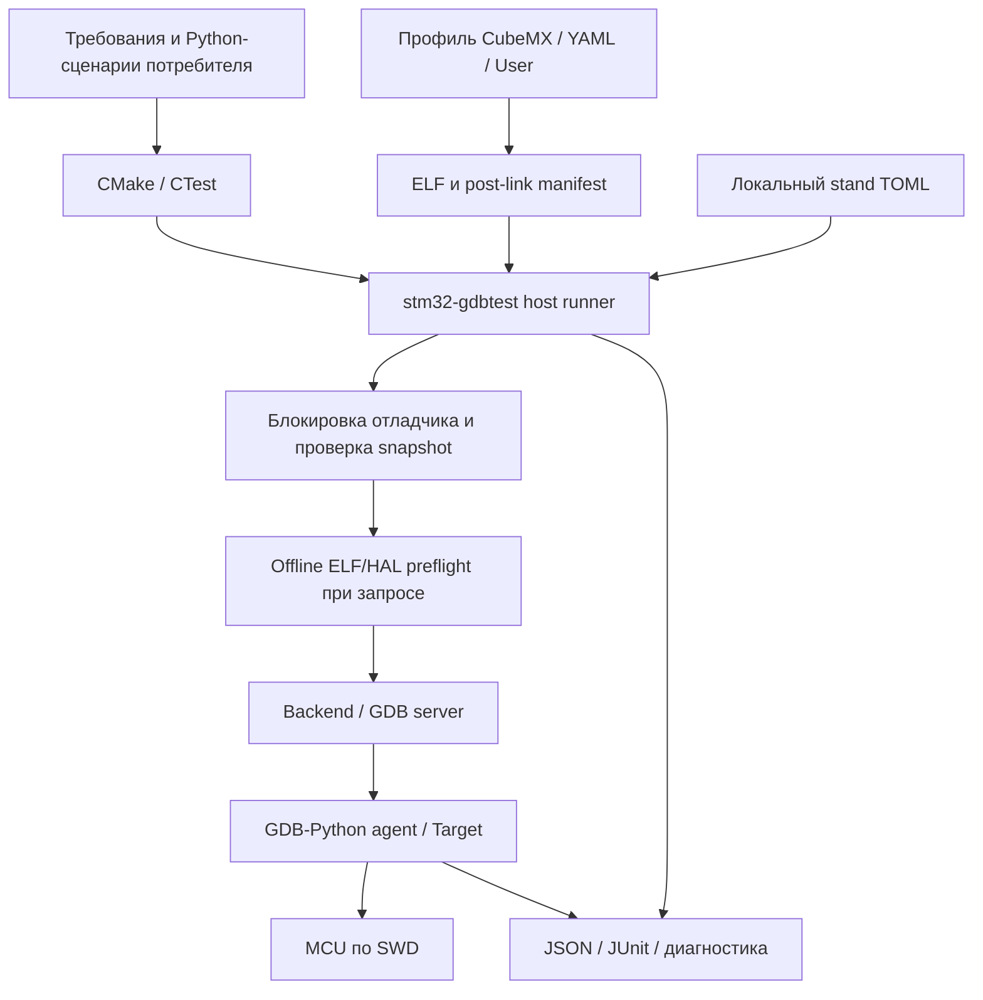

# HWTEST: фактическая архитектура v2

Обновлено после отделения stm32-gdbtest. v2 — версия этого документа, не API:
модуль пока 0.1.0.dev0, API_VERSION=1, релиз не выпущен.
[Исходный замысел](HWTEST_ARCHITECTURE.md) сохранён без изменений.
Этот общий документ описывает взаимодействие двух самостоятельных проектов;
детальный API принадлежит [stm32-gdbtest](../modules/stm32-gdbtest/docs/API.md).

## Ответственность проектов

| Проект / слой | Ответственность |
| --- | --- |
| stm32-gdbtest | CMake attach, AST collection, host runner, offline contracts, backend, GDB agent/Target, отчёты, владение отладчиком |
| stm32-hwtest-blackpill | User/Platform/Core, CubeMX/YAML, MCU-профили, требования и сценарии периферии, инструменты экспериментов, аппаратные доказательства |
| stm32-cmake-yml | Сборка firmware по YAML; не зависимость публичного API тестового модуля |
| Локальный стенд | Выбранная плата, SWD/питание, serial/executable отладчика в игнорируемом TOML |

Gitlink `modules/stm32-gdbtest` закрепляет исходники и документацию зависимости.
Ядро не дублируется в корне проекта. Потребитель добавляет свои тесты и профиль;
проверенный минимальный consumer работает без stm32-cmake-yml.
Один firmware target Windows/Ninja, один MCU/отладчик на запуск; multi-node пока нет.

## Поток проверки

Collection читает литеральные @case через AST без импорта тестового кода.
Attach создаёт session/CTest и post-link manifest. Runner выбирает stand,
удерживает блокировку, делает снимок ELF, сверяет manifest и target.toml,
проверяет запрошенные контракты отдельным GDB без подключения. Только затем
запускает сервер и runtime GDB. Сервер ST сам может обращаться к SWD при старте.
Контракт без запроса — NOT_REQUESTED, а не доказательство совместимости.

Агент проверяет наличие обязательного GDB API, identity и размер Flash,
сравнивает образ, при if-different прошивает и проверяет чтением. Verify-only
при несовпадении даёт ERROR. Затем reset/halt, main, сценарий, диагностика,
завершение по диалекту backend. Таймаут ограничивает host, recovery выполняется
отдельным клиентом. Ошибка recovery сохраняется; физическое отключение не имеет
гарантированного восстановления.

## Конфигурация и артефакты

- `profiles/f103c8`, `f401cc`, `f411ce`: CubeMX/Platform, target.toml, Tests/contracts.json,
  Tests/board и требования. `h503cb` сохранён, интеграция приостановлена владельцем.
- `profiles/f030r8`: Nucleo/Cortex-M0: target, 17 сценариев и contracts проверены offline; HW ожидается.
- `User/`: общая firmware-логика без HAL. Platform реализует ADC/таймер/LED/Sleep,
  перенаправляет HAL callbacks в app_*; это API приложения, не API тестового модуля. `Tests/scenarios`: общие проектные сценарии.
- `Tests/stands/*.local.toml`: локальная конфигурация, не часть Git.
- `tools/gdbtest.py`: вход в CLI закреплённого модуля из корня приложения.
- `build/<preset>`: ELF, manifest, session и runs потребителя. Подмодуль не используется
  для вывода. Host-проверки ядра запускаются в отдельных build/module-host копиях.
- `examples/minimal-consumer`: интеграционный fixture стенда; самостоятельный пример
  для пользователей также поставляется модулем. Согласованность проверяется явно.

Правила хранения и очистки: [BUILD_ARTIFACTS](BUILD_ARTIFACTS.md).

## Совместимость и ограничения

Совместимость — конкретная комбинация MCU/платы, HAL/CMSIS, compiler/ABI,
GDB/Python, backend/прошивки отладчика. API presence, build manifest и выборочный
ELF/HAL preflight — три разных доказательства. Их [форматы и ограничения](../modules/stm32-gdbtest/docs/MANIFESTS.md)
не подтверждают всю семантику HAL, карту памяти или корректность генерации CubeMX.
[Контракты](../modules/stm32-gdbtest/docs/CONTRACTS.md) требуют осмысленных source_reviews;
обновлять hash без анализа нельзя. [-g3 и HAL-макросы](../modules/stm32-gdbtest/docs/HAL_MACRO_GUIDE.md)
дают контекст debug info, но не сохраняют неиспользуемые функции.

DEV_ID mismatch по умолчанию предупреждает, strict отказывает до Flash. Выбранный
target не меняется автоматически; размер образа ограничен и профилем, и прочитанным
размером Flash. [Политика модуля](../modules/stm32-gdbtest/docs/TARGET_IDENTITY.md),
[опыты на экземплярах](TARGET_IDENTITY.md).

Hardware BP имеют ограниченный бюджет; pending/optimized-out и неверные причины
остановки дают явную ошибку. GDB API используется только в главном потоке.
force_return проверяет вызывающий код, пропуская тело HAL. Чтение MMIO может иметь
побочные эффекты; halt влияет на время, IRQ и периферию. «Без тестового кода в ELF»
не означает «без воздействия на MCU». Sleep под SWD не измеряет ток потребления.

PASS/FAIL/ERROR различаются в JSON/JUnit; SKIP/NOT_APPLICABLE пока нет.
Named mutex координирует участвующие процессы в одной Windows-сессии, включая
OpenOCD/ST server с одним ST-Link. VS Code/vendor tools не участвуют автоматически.
После crash освобождение mutex не доказывает завершение серверов; Job Object ещё планируется.
[Детали владения](../modules/stm32-gdbtest/docs/DEBUGGER_OWNERSHIP.md).

## Доказанная область

F103C8/F401CC/F411CE собраны, offline GDB проверяет положительный случай и 11 отказов.
После выделения Git-подмодуля F411CE/ST-Link/OpenOCD и F103C8/J-Link прошли по
24/24 CTest (22 HW + 2 host), host ядра — 44 unittest. Перенесённый read-only consumer
прошёл 3/3, Flash/verify-only/timeout/recovery и восстановление основной прошивки.
F411 live Sleep: 29/30 samples, tick +1384ms, без halt.

Ранние F401/OpenOCD/ST server и F411/ST server результаты сохраняются в протоколах;
они не означают повтор всех новых сценариев на этих комбинациях. Новые macro-сценарии
F401 требуют отдельного аппаратного прогона. H503 не заявлен поддержанным.
Количество тестов не равно структурному покрытию.

## Ближайшие доработки

Эксперимент [К1921ВГ015/RISC-V](K1921VG015_POC.md) подтвердил переносимость Target API
при отдельном JTAG lifecycle. Для production-переноса нужны явные toolchain/transport,
MCU identity/memory adapter и проверка ELF по load regions. STM32-ядро в опыте не менялось.

1. Опубликовать разделённую документацию, обновить закреплённую зависимость;
   подготовить release candidate в модуле с проверкой в этом стендовом проекте.
2. После согласованной смены платы проверить F401 с новыми macro-сценариями;
   развивать матрицу требований/периферии/отказов и явную halt/freeze policy.
3. В модуле: надзор за дочерними процессами, backend-независимая schema профиля,
   расширение manifest/capabilities; изменения подтверждать здесь положительными и отказными опытами.
4. На стенде: Stop/wakeup, контракты ADC/RTC/PWR, независимые эталоны измерений.
   UART/VCOM и H503 — после отдельного согласования.
5. Позже: host-контроллер питания/реле/кнопок с протоколом синхронизации GDB,
   reconnect/повторной identity и владением ресурсами. Драйверы приборов принадлежат стенду.

Полные планы: [проект](../TODO.md), [модуль](../modules/stm32-gdbtest/TODO.md).
Практика и ограничения: [STM32_TESTING_METHODS](STM32_TESTING_METHODS.md).
Навигация по всем деталям: [карта документации](README.md).

## Уточнение проверки образа после опытов переноса

Модуль сравнивает только загружаемые ELF-секции по LMA. BIN нормализуется
заполнением промежутков 0xFF, но исходный GDB load ELF их не гарантирует.
Проверка полной области/CRC требует отдельного контракта и режима записи.
[Механизм модуля](../modules/stm32-gdbtest/docs/IMAGES.md),
[проверки на текущих STM32-стендах](ELF_LOAD_REGIONS.md).

### Полный образ как отдельный вход runner

Опциональный TOML image policy задаёт диапазон и fill. Ядро создаёт canonical BIN
и односекционный ELF для GDB, сохраняет исходный ELF для символов, сравнивает весь
readback и CRC-32/ISO-HDLC на ПК. Это не MCU CRC и не встроенное CRC-поле firmware.
Умолчание остаётся load sections. [Контракт](../modules/stm32-gdbtest/docs/IMAGES.md),
[реальная проверка](FULL_IMAGE_CRC.md).
