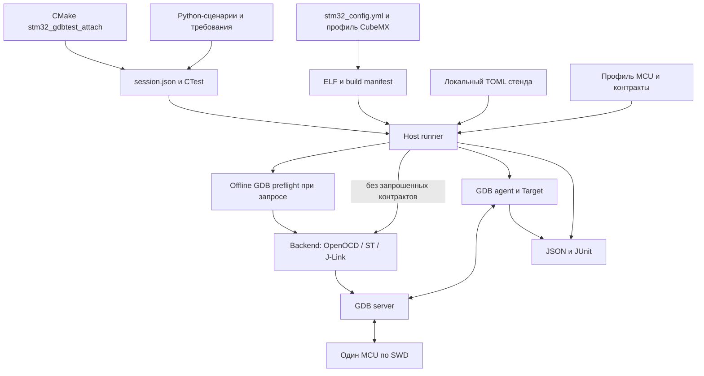

# HWTEST: фактическая архитектура v2

Статус: текущий вариант описания реализации, не спецификация завершённого продукта.
Базовый срез: коммит `ad6f4c1` (2026-09-23); обновлено по проверке F411/ST-Link
2026-09-24. Обозначение **v2 относится к документу**,
а не к версии Python API или схем конфигурации: используемые versioned schemas пока имеют номер 1.

[Исходный документ](STM32_GDBTEST_ARCHITECTURE.md) сохраняется как описание замысла и
анализа BOARD_TEST. Его примеры — проектные скелеты; фактический интерфейс описан
здесь и в документах по ссылкам. Ниже различаются три состояния:
**реализовано**, **проверено на указанной комбинации**, **планируется**.
Наличие реализации не доказывает её переносимость на другие MCU, HAL или серверы.

> Обновление имён и новый f401cc: [PROFILE_MIGRATION](PROFILE_MIGRATION.md).
> F401CC — штатный профиль: 24/24 CTest через OpenOCD и ST server на текущем
> экземпляре (маркировка F401CC, DEV_ID0x431). Общая политика warn/strict и проверка
> Flash: [TARGET_IDENTITY](TARGET_IDENTITY.md). Второй экземпляр с DEV_ID0x423 также прошёл OpenOCD 24/24;
> ST server/strict после переподключения USB тоже 24/24 PASS, live Sleep PASS.

> Подготовка выделения **stm32-gdbtest**: [MODULE_EXTRACTION](MODULE_EXTRACTION.md).
> Самостоятельный consumer без YAML/framework собран, build/offline проверки PASS;
> module/consumer paths разделены. [HW lifecycle F411/ST-Link/OpenOCD](CONSUMER_VALIDATION.md)
> проверен с timeout/recovery и восстановлением основной прошивки. Перенос дерева
> исходников/read-only ACL подтверждён, CTest3/3; [межпроектный mutex](DEBUGGER_OWNERSHIP.md) реализован в одной Windows-сессии.

> Namespace перенесён: [публичный API прототипа и миграция](STM32_GDBTEST_API.md).

> Отделение завершено: gitlink modules/stm32-gdbtest → f9d9f53; ядро и его host-тесты
> больше не дублируются в корне приложения. Публичный интерфейс — из подмодуля.

## 1. Назначение и текущий масштаб

Система проверяет реальную STM32-прошивку через SWD, GDB-сервер и GDB-Python.
Тестовые функции не компилируются и не линкуются в firmware. При этом остановки
ядра, reset, запись переменных и принудительный возврат из функций изменяют
выполнение MCU. Термин «неинвазивность» здесь означает отсутствие тестового кода
в образе, а не отсутствие воздействия отладчика на поведение и время.

Реализован полный цикл одного теста на одном MCU: сборка, выбор стенда, проверка
образа, при необходимости прошивка, выполнение Python-сценария, диагностика и
завершение. Это рабочая минимальная реализация внутри проекта, ещё не независимый
пакет для произвольного STM32-приложения.

Текущие ограничения масштаба: Windows, PowerShell/VS Code, CMake/Ninja, xPack ARM GCC,
одна firmware-цель и один отладчик на запуск. Для host требуется Python 3.11+;
Python внутри GDB — отдельная среда. Версия GCC не определяет доступность GDB API.
Фактически применялся GDB 14.2.90 со встроенным Python 3.11.4; руководство
[gdb.pdf](gdb.pdf), раздел 23.3, описывает GDB 19.

## 2. Слои и границы ответственности

| Слой | Реализованная ответственность | Основные файлы |
| --- | --- | --- |
| Сборка приложения | MCU-профиль, CubeFW, исходники, toolchain; stm32-cmake-yml остаётся системой сборки | `stm32_config.yml`, `profiles/`, `modules/` |
| CMake-интеграция HWTEST | Сессия, AST-сбор тестов, CTest, manifest после линковки, цель check-hw | [STM32GDBTest.cmake](../modules/stm32-gdbtest/stm32_gdbtest/cmake/STM32GDBTest.cmake) |
| Host-оркестратор | Владение отладчиком, снимки артефактов, preflight, процессы, таймауты, отчёты | [runner.py](../modules/stm32-gdbtest/stm32_gdbtest/runner.py), [processes.py](../modules/stm32-gdbtest/stm32_gdbtest/processes.py) |
| Backend | Аргументы сервера, признак готовности, setup/reset/finish конкретного сервера | [backends.py](../modules/stm32-gdbtest/stm32_gdbtest/backends.py), [openocd.py](../modules/stm32-gdbtest/stm32_gdbtest/openocd.py) |
| GDB-агент | GDB API checks, подключение, MCU identity, Flash verify/load, выполнение сценария и диагностика | [agent.py](../modules/stm32-gdbtest/stm32_gdbtest/agent.py) |
| API сценария | Проверки, значения и поля, hardware breakpoints, инъекции | [target.py](../modules/stm32-gdbtest/stm32_gdbtest/target.py) |
| Проектные тесты | Что именно должно делать приложение; ожидаемые MCU-различия | `Tests/scenarios/`, `profiles/<MCU>/Tests/` |

`modules/stm32-gdbtest` является Git-подмодулем с закреплённым коммитом. В коде есть привязки
к корню проекта, размещению Tests, build и профилей. Backend также содержит явное
отображение поддержанного J-Link device. До выделения подмодуля эти зависимости
нужно превратить в документированные параметры или профильные данные.

## 3. Конфигурация и организация каталогов

| Артефакт | Назначение и статус |
| --- | --- |
| `stm32_config.yml` | Общая конфигурация сборки с профилями f103c8/f411ce |
| `profiles/<MCU>/` | Собственные IOC, CubeMX Core/startup/linker, Platform и Tests; генерация MCU разнесена по папкам |
| `User/` | Общая бизнес-логика приложения; это firmware, не часть движка тестирования |
| `profiles/<MCU>/Platform/` | Адаптация приложения к MCU; не универсальный GDB/HAL-адаптер |
| `target.toml` | Строгая schema 1: identity, Flash, ловушки, диагностика, лимит точек; ещё содержит обязательные OpenOCD-поля |
| `Tests/expectations.py` внутри профиля | Проектные ожидания для MCU, pinout, DMA, ADC и других сценариев |
| `Tests/contracts.json` внутри профиля | Schema 1 предварительных ELF/HAL-проверок; заполнена для семи сценариев каждого профиля F103/F411 |
| `Tests/stands/*.local.toml` | Локальные backend, executable, serial и параметры соединения; не коммитятся |
| `build/<preset>/hwtest/session.json` | Генерируемые пути ELF, GDB, тестов, профиля, стенда, manifest и результатов |

Выбор профиля сборки — `STM32_YML_PROFILE`; для каждого MCU и компилятора нужен
отдельный build-каталог. Выбор стенда: `--stand`, затем `STM32_GDBTEST_STAND`, затем поле
сессии. MCU-профиль и отладчик — разные измерения конфигурации. Автоматического
выбора подключённой платы или подтверждения правильной разводки нет.

Сейчас J-Link нужно выбирать явно: default сессии F103 остаётся ST-Link.
Перед каждым аппаратным набором объявляются плата/MCU, отладчик, backend и
соединения. Физическое переключение начинается с подтверждения владельца.
Процедуры запуска и настройки: [HWTEST](HWTEST.md), [GDB_BACKENDS](GDB_BACKENDS.md),
[JLINK](JLINK.md). Сведения о платах и VS Code/SVD: [README](../README.md).

## 4. Подключение к CMake и обнаружение тестов

Используется явное подключение, соответствующее Level 1 исходной архитектуры:
`ENABLE_HW_TESTING`, include файла HWTEST и вызов
`stm32_gdbtest_attach(${PROJECT_NAME} PROFILE_DIR "${BOARD_DIR}")` после создания firmware-цели.
Level 0 через `CMAKE_PROJECT_INCLUDE`/DEFER пока не реализован.

Декоратор `@case` задаёт ID, timeout, labels и необязательный список contracts.
Host читает литералы через AST, не импортируя GDB-код тестов. В CTest регистрируется
один тест на сценарий; соответствие ID требованиям проверяется отдельным host-тестом.
ID не обязан совпадать с именем Python-файла: несколько сценариев объединяются в файл.

Цель `check-hw` зависит от firmware и запускает CTest, включая host-проверки.
Прямой запуск `ctest` сам прошивку не пересобирает. CLI сейчас содержит collect,
trace и run; отдельные команды flash/probes из исходного проекта не реализованы.

## 5. Фактическая последовательность запуска

1. Host создаёт отдельный каталог запуска, читает стенд и профиль, проверяет timeout
   и берёт блокировку по серийному номеру отладчика.
2. Копирует ELF в каталог запуска и вычисляет SHA-256. Для новых CMake-сессий
   проверяет соответствие build manifest этому ELF и текущему target.toml.
3. Если сценарий объявил contracts, выбирает их профильные декларации. Проверяет
   reviewed-source hashes по build manifest и запускает отдельный offline GDB.
   Ошибка этого этапа не запускает GDB-сервер и не подключает MCU.
4. Подготавливает бинарный образ через objcopy, проверяет размер относительно Flash
   и работоспособность GDB-Python. Выбирает локальный порт и формирует backend-команды.
5. Запускает сервер, ожидает его признак готовности, затем запускает GDB-агент
   с ELF-снимком. Auto-load отключён; входной Python-скрипт указан явно.
6. Агент проверяет обязательные GDB API, подключается, выполняет backend setup/reset,
   сверяет MCU identity. Сравнивает байты Flash с подготовленным образом; при политике
   if-different загружает несовпадающий образ и повторяет проверку. Verify-only запрещает запись.
7. Создаёт Target, ставит профильные ловушки и достигает main после reset.
   Импортирует выбранный тест и выполняет его.
8. При ошибке собирает доступные регистры и backtrace. Удаляет принадлежащие ему
   точки, выполняет backend finish. Host при необходимости пытается восстановить
   запуск отдельным GDB-клиентом, завершает процессы и записывает отчёты.

GDB API presence в основном агенте проверяется до его target connect, но сервер
к этому моменту уже запущен и может обращаться к SWD. Это отличается от отдельного
ELF/HAL preflight, который проходит **до запуска сервера**.

## 6. Совместимость и доказательства

Реализованы три разных вида сведений, которые нельзя подменять друг другом:

| Механизм | Что подтверждает | Чего не подтверждает |
| --- | --- | --- |
| Post-link build manifest schema 1 | Привязку снимка исходников/объектов, версий Cube/HAL/CMSIS и compiler metadata к ELF/profile SHA | Полную воспроизводимость, подпись происхождения, семантику HAL |
| Runtime compatibility schema 1 | Фактические GDB/Python, распознанные версии сервера/firmware отладчика и доступность GDB API | Совместимость любой платы с этим сочетанием версий |
| Выборочный ELF/HAL preflight schema 1 | Запрошенные сигнатуры, аргументы, поля, enum и совпадение хешей вручную изученных исходников | Полное HAL API, эффективные макросы, доступность runtime-значений, IRQ-маршрут |

Manifest создаётся после линковки через Ninja dependencies. Предполагаются надёжные
timestamps, неизменный toolchain и отсутствие параллельного редактирования во время
сборки. Полные linker flags и предсобранные runtime libraries не охвачены. Во время
HW-run текущие исходники не перечитываются для восстановления версии старого ELF.
Legacy-сессии без manifest поддерживаются с явным unavailable.

HAL-контракты задаются отдельно для профиля. Типы разрешаются в контексте функции,
поскольку глобальный lookup одноимённых C/C++ типов дал ложные несовпадения.
NULL-инъекции RCC F103/F411 привязаны к хешу рассмотренного HAL-исходника; изменение
хеша требует повторного анализа. Остальные пятнадцать сценариев имеют
`contracts.status=NOT_REQUESTED`, а не доказанную совместимость.

Детали схем и границ: [COMPATIBILITY](COMPATIBILITY.md), [HAL_CONTRACTS](HAL_CONTRACTS.md).
`-g3` полезен для макросов, но не сохраняет неиспользуемые функции и не исключает
optimized-out при оптимизации.

## 7. Жизненный цикл, API и отчёты

`Target` предоставляет reach, breakpoint, value, fields, check, set_value и force_return.
Используются hardware breakpoints, контроль pending и профильный бюджет точек;
у J-Link Flash breakpoints явно отключены. Условные остановки дополнительно
проверяют условие после остановки. Мутации заносятся в отчёт.

Главный ограничитель времени — внешний host-timeout, поверх него есть CTest timeout
с запасом на подготовку и recovery. GDB API вызывается в основном Python-потоке GDB.
Модельный timeout по watchpoint не реализован. Windows-процессы завершаются через
`taskkill /T /F`; Job Object и POSIX process groups пока отсутствуют.

CTest RESOURCE_LOCK и файловая блокировка защищают запуски внутри checkout.
Они не обеспечивают глобальное владение отладчиком между разными репозиториями
или сторонними IDE. Выбор свободного порта не равен его атомарному резервированию.

Нормальная политика завершения — reset_run с проверенными backend-командами.
Это подходит текущему демонстрационному приложению, но не является универсальным
безопасным состоянием силовой установки. Нет настраиваемого safe-state hook,
нескольких узлов, peer-release или гарантированного восстановления после гибели
самого оркестратора, отключения USB либо питания.

Каталог запуска содержит копию ELF/образа, JSON и JUnit, журналы GDB/server,
при наличии — manifest и результаты contract preflight/recovery. Host различает
PASS (0), FAIL (1) и ERROR (2). SKIP/NOT_APPLICABLE и код 77 пока не реализованы;
отсутствующий стенд — ERROR. Номер/количество успешных тестов не является покрытием кода.
Метаданные версий не публикуют полные персональные пути/serial, но диагностические
логи не являются автоматически обезличенными.

## 8. Матрица фактической проверки

| MCU / плата | Отладчик и backend | Подтверждённый объём |
| --- | --- | --- |
| F103, WeAct BluePill V1.1 / BluePill-Plus, LED PB2 | J-Link / J-Link GDB Server V8.32 | 22 HW + 2 host CTest; build manifest и семь HAL-контрактов; после уточнения схемы повторно 7/7 HW |
| F103, та же плата | ST-Link / OpenOCD 0.12.0 | 24/24 CTest на предшествующем этапе; новые manifest/HAL изменения требуют регрессии |
| F103, та же плата | ST-Link / ST GDB Server 7.14.0 | 24/24 CTest на предшествующем этапе; новые manifest/HAL изменения требуют регрессии |
| F411, WeAct BlackPill V3.1, LED PC13 | ST-Link / OpenOCD | 24/24 CTest, ADC/Sleep/manifest/HAL, timeout/recovery |
| F411 | ST-Link / ST GDB Server 7.14.0 | 24/24 на том же ELF, timeout/recovery; Flash подтверждён без повторной записи |
| F411 | J-Link | Пока не проверено; mapping J-Link ещё нужно добавить |
| H503, WeAct STM32H503CBT6 | Не выбран | IOC/Core/SVD получены; профиль не включён в CMake, работы отложены владельцем |

В текущем host.hwtest — 27 unittest. Отдельная offline-регрессия настоящего GDB
проверяет семь контрактов (80 проверок) и семь намеренно неверных вариантов, включая неверный const;
она не включена автоматически в CTest. Прогон 24/24 означает прохождение конкретного
набора на конкретной версии, а не поддержку всех комбинаций матрицы.

История аппаратных доказательств: [HARDWARE_VALIDATION](HARDWARE_VALIDATION.md),
[GDB_BACKENDS](GDB_BACKENDS.md), [JLINK](JLINK.md), [STM32_TESTING_METHODS](STM32_TESTING_METHODS.md).

## 9. Отличия от исходного замысла

| Исходное предложение | Фактическое решение / причина или оставшаяся работа |
| --- | --- |
| Самодостаточный hwtest-подмодуль | Пока каталог проекта; выделение после проверки границ на другом потребителе |
| Level 0 либо Level 1 | Реализован только явный Level 1 |
| Windows/Linux/macOS | Реализация ограничена Windows; build manifest — Ninja |
| Многоузловой стенд и nodes в тестах | Один MCU на запуск; нет координации соседних узлов |
| Единый Tests/hwtest.toml | Разделены сборочный YAML, target.toml, локальный стенд, expectations и contracts |
| state.json + compare-sections, возможный Build-ID | Снимок ELF/SHA-256 и чтение байтов Flash при каждом запуске; кеш доверия не используется |
| Класс Probe с release/probe_present | Фабрика backend-команд; самостоятельного peer-release и обнаружения для SKIP нет |
| Универсальный диалект прошивки/reset | Общий GDB load, но setup/reset/finish проверяются для каждого сервера отдельно |
| Job Object, safe-state hook, SKIP | Пока taskkill, reset_run и ERROR при недоступном стенде |
| API-скелеты break_at/expect/run_function | Небольшой фактический Target API; force_return не делает неявный finish вызывающей функции |
| Совместимость в основном через общий GDB API | Добавлены build/runtime metadata и выборочные HAL-контракты по результатам опытов |

Эти отличия не следует автоматически считать дефектами. Часть — сознательное
ограничение MVP, часть — уточнение после аппаратных проверок. Однако ограничения
изоляции процессов, владения стендом и переносимости должны быть устранены или
явно приняты перед использованием модуля в более широком окружении.

## 10. Ближайшие доработки и критерии завершения

Актуальная последовательность без сроков — [TODO](../TODO.md). Сейчас одновременно
подключены F411/ST-Link и F103/J-Link. Этап F411/ST-Link выполнен раньше F411/J-Link
по доступности стендов; до переключений можно продолжать выделение модуля.
Оставшиеся задачи:

1. **F411 + J-Link после подтверждения смены платы.** Добавить device mapping,
   использовать уже проверенные сборку/manifest и контракты HAL F4, повторить
   общий набор, включая ADC с заводской калибровкой и Sleep. Критерий: отчёты именно
   F411, успешное завершение и описанные отличия; старые F103 PASS не переносить.
2. **Закрыть матрицу серверов.** F411 + ST-Link через OpenOCD/ST server уже проверен;
   остаётся регрессия новых механизмов на F103 + ST-Link. Критерий: одинаковый ELF внутри
   сравниваемой комбинации MCU, проверка ошибок/recovery и документированные исключения.
3. **Отделить модуль от приложения.** Явные module_root/project_root, параметры
   tests/profile/output, backend-независимая схема профиля, версионируемый API.
   Проверить отдельный проект-потребитель внутри workspace. Критерий: подключение
   требует конфигурации и проектных тестов, но не правок ядра hwtest.
4. **Расширить модель совместимости.** Контракты остальных сценариев, версия адаптера,
   effective macros, применимость и ограничения возможностей; продумать SKIP отдельно
   от ERROR. Критерий: неподдержанная возможность не превращается в PASS и не исчезает
   из трассируемости; есть положительные и отрицательные проверки механизма.
5. **Расширять методы и оценку покрытия.** Явная halt/freeze policy, Stop/wakeup,
   watchpoints и наблюдение без halt; матрица требований/периферии/отказов и отдельный
   способ измерения структурного покрытия. UART/VCOM — только после согласования.

Кроссплатформенность, CI, глобальная блокировка, более надёжное управление процессами,
политики safe-state и многоузловые стенды требуют самостоятельных этапов; ближайшие
успехи F1/F4 не будут означать их готовность. H503 остаётся отложенным до сообщения
владельца, его IOC/генерация на текущем этапе не изменяются.

## 11. Где находятся детали

| Документ | Что искать |
| --- | --- |
| [HWTEST](HWTEST.md) | Команды, сборка, запуск, артефакты |
| [COMPATIBILITY](COMPATIBILITY.md) | Manifest, версии, ограничения совместимости |
| [HAL_CONTRACTS](HAL_CONTRACTS.md) | Декларации preflight, reviewed-source hashes, offline-регрессия |
| [STM32_TESTING_METHODS](STM32_TESTING_METHODS.md) | Практические методы, положительный/отрицательный опыт, влияние отладчика |
| [GDB_BACKENDS](GDB_BACKENDS.md), [JLINK](JLINK.md) | Настройки и фактические различия серверов |
| [ADC_MEASUREMENTS](ADC_MEASUREMENTS.md) | Формулы, источники калибровки, качество измерений |
| [PERIPHERAL_PLAN](PERIPHERAL_PLAN.md) | План периферии и покрытия для MCU |
| [H503_CUBEMX](H503_CUBEMX.md) | Отложенный H503 и аудит CubeMX |
| [TODO](../TODO.md), [CHANGELOG](../CHANGELOG.md) | Порядок дальнейшей работы и история изменений |

При развитии реализации этот документ обновляется вместе с изменением границ/API
и матрицы проверки. Подробные журналы опытов остаются в профильных документах;
исходная архитектура сохраняет роль исторического предложения.

## Уточнение runtime identity

Агент теперь предупреждает при DEV_ID mismatch и продолжает по выбранному target;
strict останавливает до Flash. Затем читается заводской размер Flash и проверяется
образ относительно обеих границ. Это общий механизм, а не исключение f401cc.
Схема target 1 получила flash_size_address; старые профили без него отклоняются
при HW-запуске. Подробнее: [TARGET_IDENTITY](TARGET_IDENTITY.md).

Новая политика также проверена на F103C8/J-Link: 24/24 CTest, strict boot PASS.
DEV_ID совпадает (0x410), ёмкость128 KiB против профиля64 KiB предупреждает,
не расширяя выбранную карту памяти. Проверенные комбинации и ограничения:
[TARGET_IDENTITY](TARGET_IDENTITY.md).

F411CE/ST-Link также проверен с новой identity/Flash политикой: OpenOCD/ST server
strict24/24 PASS. Эксперимент function-like HAL macros подтверждён отдельным
сценарием; macro contracts теперь включены в offline preflight (описание ниже).
[Методика](STM32_TESTING_METHODS.md#hal-макросы-в-gdb-проверка-на-f411ce).

## Макросы HAL/CMSIS и подготовка отделения

Macro preflight теперь реализован в общем contracts schema1: явный context,
info macro и macro expand в отдельном offline GDB, без вычисления выражения.
GPIO clock/поля RCC и GPIO/TIM2 ARR обновлены в трёх профилях; аппаратные значения
проверяются сценариями, а preflight подтверждает только наличие/раскрытие.
[Руководство](HAL_MACRO_GUIDE.md), [границы и кандидаты имени модуля](MODULE_EXTRACTION.md).
Новый публичный namespace ещё не выбран, текущие импорты hwtest сохранены.
