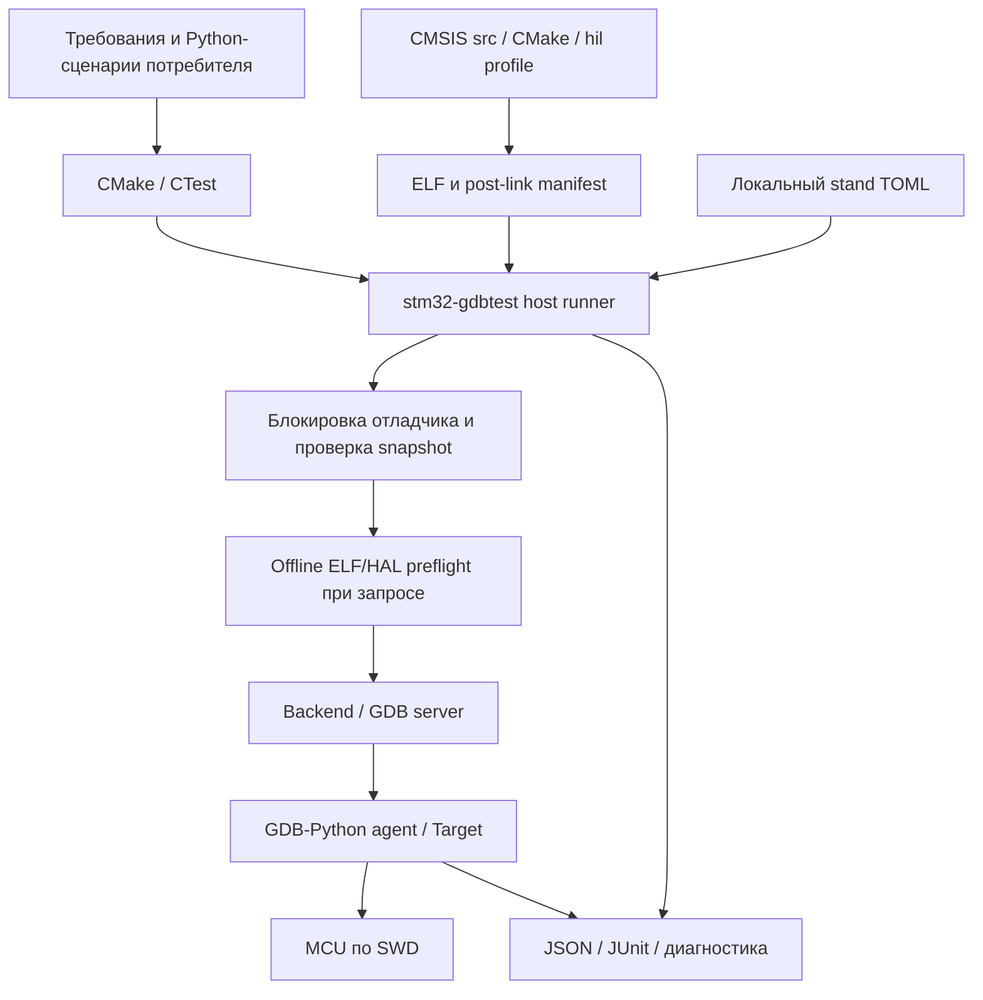

# HWTEST: фактическая архитектура v2

Обновлено 2026-10-02. v2 — версия этого документа, не API:
подключён stm32-gdbtest `v0.1.0-rc.2` (`a0d6547`), API_VERSION=1.
Версия Python `0.1.0rc2`; опубликованный тег rc.2 закреплён на `a0d6547`.
Более поздние CMSIS fixtures и HAL F030-опыты доступны по историческим ссылкам;
они не входят в закреплённый релиз. Runtime/CLI/CMake-код совпадает с прежним da42cd7.
[Исходный замысел](HWTEST_ARCHITECTURE.md) сохранён без изменений.
Этот общий документ описывает взаимодействие двух самостоятельных проектов;
детальный API принадлежит [stm32-gdbtest](https://github.com/ViacheslavMezentsev/stm32-gdbtest/blob/a0d6547ba83b7c911f8f3028cb064aeedd3e5a36/docs/ru/API.md).

## Ответственность проектов

Переход к самостоятельному CMSIS consumer завершён: F411CE/F401CC здесь,
общая матрица MCU и механизм — в stm32-gdbtest. Прежние HAL-профили сохранены
в legacy/hal; examples и profiles/h503cb оставлены отдельно вне активного CI.
[Дерево проекта](PROJECT_LAYOUT.md), [текущий план](../TODO.md).

| Проект / слой | Ответственность |
| --- | --- |
| stm32-gdbtest | CMake attach, AST collection, host runner, offline contracts, backend, GDB agent/Target, отчёты, владение отладчиком |
| stm32-hwtest-blackpill | CMSIS-приложение src, hil-профили, требования и сценарии периферии, инструменты экспериментов, аппаратные доказательства |
| stm32-cmake-yml | Историческая зависимость HAL-сборки, исключена из текущего проекта |
| Локальный стенд | Выбранная плата, SWD/питание, serial/executable отладчика в игнорируемом TOML |

Gitlink `modules/stm32-gdbtest` закрепляет исходники и документацию зависимости.
Ядро не дублируется в корне проекта. Потребитель добавляет свои тесты и профиль;
проверенный минимальный consumer работает без stm32-cmake-yml.
Один firmware target/Ninja, один MCU/отладчик на запуск; multi-node пока нет.
Модуль поддерживает Windows/Linux, удалённый GDB-сервер по SSH и пакеты запусков.
Аппаратные проверки потребителя выполняются на Windows. Для Linux добавлен
[Docker CI build/host/prepare](CI.md); QEMU/Renode + GDB остаются отдельным возможным опытом после выбора модели F4.
Штатные `prepare.*` проверяют подготовку сценариев без подключения к оборудованию.
Новые возможности модуля и DDTT описаны в его документации; исторические аппаратные
результаты ниже не являются регрессией на новой ревизии.

## Поток проверки

```mermaid
flowchart TD
    P[CMSIS src / CMake / hil profile] --> E[ELF и post-link manifest]
    T[Требования и Python-сценарии потребителя] --> C[CMake / CTest]
    C --> R[stm32-gdbtest host runner]
    E --> R
    S[Локальный stand TOML] --> R
    R --> L[Блокировка отладчика и проверка snapshot]
    L --> O[Offline ELF/HAL preflight при запросе]
    O --> B[Backend / GDB server]
    B --> A[GDB-Python agent / Target]
    A --> M[MCU по SWD]
    A --> J[JSON / JUnit / диагностика]
    R --> J
```

Collection читает литеральные @case через AST без импорта тестового кода.
Attach создаёт session/CTest и post-link manifest. Runner выбирает stand,
удерживает блокировку, делает снимок ELF, сверяет manifest и target.toml,
проверяет запрошенные контракты отдельным GDB без подключения. Только затем
запускает сервер и runtime GDB. Сервер ST сам может обращаться к SWD при старте.
Контракт без запроса — NOT_REQUESTED, а не доказательство совместимости.

Агент проверяет наличие обязательного GDB API, identity и размер Flash,
сравнивает образ, при if-different прошивает и проверяет чтением. Verify-only
при несовпадении даёт ERROR. Затем reset/halt, main, сценарий, диагностика,
завершение по диалекту backend. Таймаут ограничивает host, recovery выполняется
отдельным клиентом. Ошибка recovery сохраняется; физическое отключение не имеет
гарантированного восстановления.

## Конфигурация и артефакты

- `src/`, `cmsis/`, `ld/`, `cmake/`: активная прошивка и сборка без HAL/YAML.
- `hil/profiles/f401cc.toml`, `f411ce.toml`: MCU и границы памяти; общие сценарии
  `hil/tests/board`, требования `hil/tests/requirements.md`, native ADC — `hil/tests/native`.
- `hil/stands/*.local.toml`: приватные настройки отладчика для HIL presets.
- `tools/gdbtest.py`: CLI; `build/HIL_<MCU>/hwtest`: session/manifest/runs.
- `legacy/hal`: архив; `profiles/h503cb` и `examples`: сохранённые отдельные проекты.
- `tests/stands` и прочие старые tools/tests не входят в текущую CMSIS-регрессию.

Правила хранения и очистки: [BUILD_ARTIFACTS](BUILD_ARTIFACTS.md).

## Совместимость и ограничения

Совместимость — конкретная комбинация MCU/платы, HAL/CMSIS, compiler/ABI,
GDB/Python, backend/прошивки отладчика. API presence, build manifest и выборочный
ELF/HAL preflight — три разных доказательства. Их [форматы и ограничения](https://github.com/ViacheslavMezentsev/stm32-gdbtest/blob/a0d6547ba83b7c911f8f3028cb064aeedd3e5a36/docs/ru/MANIFESTS.md)
не подтверждают всю семантику HAL, карту памяти или корректность генерации CubeMX.
[Контракты](https://github.com/ViacheslavMezentsev/stm32-gdbtest/blob/a0d6547ba83b7c911f8f3028cb064aeedd3e5a36/docs/ru/CONTRACTS.md) требуют осмысленных source_reviews;
обновлять hash без анализа нельзя. [-g3 и HAL-макросы](https://github.com/ViacheslavMezentsev/stm32-gdbtest/blob/a0d6547ba83b7c911f8f3028cb064aeedd3e5a36/docs/ru/HAL_MACRO_GUIDE.md)
дают контекст debug info, но не сохраняют неиспользуемые функции.

DEV_ID mismatch по умолчанию предупреждает, strict отказывает до Flash. Выбранный
target не меняется автоматически; размер образа ограничен и профилем, и прочитанным
размером Flash. [Политика модуля](https://github.com/ViacheslavMezentsev/stm32-gdbtest/blob/a0d6547ba83b7c911f8f3028cb064aeedd3e5a36/docs/ru/TARGET_IDENTITY.md),
[опыты на экземплярах](TARGET_IDENTITY.md).

Hardware BP имеют ограниченный бюджет; pending/optimized-out и неверные причины
остановки дают явную ошибку. GDB API используется только в главном потоке.
force_return проверяет вызывающий код, пропуская тело HAL. Чтение MMIO может иметь
побочные эффекты; halt влияет на время, IRQ и периферию. «Без тестового кода в ELF»
не означает «без воздействия на MCU». Sleep под SWD не измеряет ток потребления.

PASS/FAIL/ERROR различаются в JSON/JUnit; SKIP/NOT_APPLICABLE пока нет.
Named mutex координирует участвующие процессы в одной Windows-сессии, включая
OpenOCD/ST server с одним ST-Link. VS Code/vendor tools не участвуют автоматически.
После crash освобождение mutex не доказывает завершение серверов; актуальный механизм
завершения процессов описан в закреплённом модуле.
[Детали владения](https://github.com/ViacheslavMezentsev/stm32-gdbtest/blob/a0d6547ba83b7c911f8f3028cb064aeedd3e5a36/docs/ru/DEBUGGER_OWNERSHIP.md).

## Доказанная область и следующие шаги

CMSIS F411CE/F401CC: по14 аппаратных сценариев, по12 повторов после инъекций,
внешний timeout/recovery и восстановление прежней HAL-прошивки. Последующая
перестройка каталогов сохранила load images; повторным аппаратным запуском это
не является. Release собран, аппаратно проверен Debug. [Протокол](BLACKPILL_CMSIS_APPLICATION.md).

Текущий CI: шесть Debug/Release/HIL сборок и31 CTest на Windows/Linux (30 host
prepare/traceability и один native ADC). Offline пакета76d50b0 прошёл на GitHub,
пакет включён в main. Это не эмуляция и не измерение структурного покрытия.
Результаты F030/F103/F429/HAL/full-image из старых протоколов являются историческими.

Следующие задачи — сопровождение двух профилей, измерение расходов тестирования,
проектные оптимизации и дальнейшие опыты. Общие изменения runner/адаптеров,
ARM/RISC-V, multi-node и внешняя синхронизация относятся к модулю.
[План](../TODO.md), [методика](STM32_TESTING_METHODS.md).

## Уточнение проверки образа после опытов переноса

Модуль сравнивает только загружаемые ELF-секции по LMA. BIN нормализуется
заполнением промежутков 0xFF, но исходный GDB load ELF их не гарантирует.
Проверка полной области/CRC требует отдельного контракта и режима записи.
[Механизм модуля](https://github.com/ViacheslavMezentsev/stm32-gdbtest/blob/a0d6547ba83b7c911f8f3028cb064aeedd3e5a36/docs/ru/IMAGES.md),
[проверки на текущих STM32-стендах](ELF_LOAD_REGIONS.md).

### Полный образ как отдельный вход runner

Опциональный TOML image policy задаёт диапазон и fill. Ядро создаёт canonical BIN
и односекционный ELF для GDB, сохраняет исходный ELF для символов, сравнивает весь
readback и CRC-32/ISO-HDLC на ПК. Это не MCU CRC и не встроенное CRC-поле firmware.
Умолчание остаётся load sections. [Контракт](https://github.com/ViacheslavMezentsev/stm32-gdbtest/blob/a0d6547ba83b7c911f8f3028cb064aeedd3e5a36/docs/ru/IMAGES.md),
[реальная проверка](FULL_IMAGE_CRC.md).

Уточнение целевой структуры и описания по образцу BluePill — [план синхронизации](REPOSITORY_ALIGNMENT.md).
